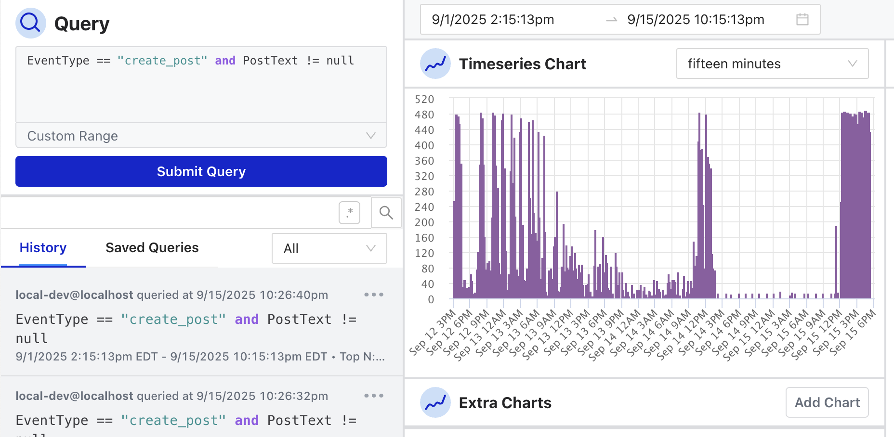

# Osprey

Open-source event stream decisions engine and analysis UI designed to investigate and take automatic action on events and their properties as they happen in real-time. Originally developed internally at [Discord](https://discord.com/) to combat spam, abuse, botting, and scripting across its platform, Osprey has been open-sourced to help other platforms facing similar challenges.

Osprey is a library for processing actions through human-written rules and outputting verdicts & custom effects back to configurable output sinks. It evaluates events using structured rule logic (SML) that is extendable via user-defined functions (UDFs). Osprey can also track state across events by labelling entities if implementers provide a labels service backend (see [labels_service.py](./example_plugins/src/services/labels_service.py) for a Postgres-backed labels service example)

This 'Rules + Investigation' tool is able to:

- take action based on user behavior
- combine actions with human written rules
- let operators query human actions and past decisions
- perform investigations or write new rules based on decisions

Osprey is built for engineers and Trust & Safety teams who want to explore, test, and integrate its core capabilities into their platform for incident response and Trust & Safety investigation.

## Development

- See [DEVELOPMENT.md](./docs/DEVELOPMENT.md) for comprehensive development setup and workflow documentation
- All code changes should pass linting (Ruff) and type checking (MyPy)
- Pre-commit hooks automatically run on each commit to maintain code quality

## Join Us

Writing code is not the only way to help the project. Reviewing pull requests, answering questions to help others on mailing lists or issues, providing feedback from a domain expert perspective, organizing and teaching tutorials, working on the website, improving the documentation, are all priceless contributions.

- Join us in [our Discord server](https://discord.gg/5Csqnw2FSQ)
- Join our [newsletter](https://roost.tools/#get-started) for more announcements and information
- Follow us on [Bluesky](https://bsky.app/profile/roost.tools) or [LinkedIn](https://www.linkedin.com/company/roost-tools/)

_[ROOST](https://roost.tools) (Robust Open Online Safety Tools) is a non-profit organization that brings together expertise, resources, and investments from major technology companies and philanthropies to build scalable, interoperable safety infrastructure for the AI era._

### Feedback Wanted

This is a working system, not a prototype. Try it locally, connect your data, write some rules, and tell us what's missing for your use case. We're particularly interested in:

- Integration challenges with your existing platform infrastructure
- Performance characteristics with your event volumes and rule complexity
- Missing detection capabilities or response actions you need
- API improvements that would make adoption easier for your team

Your experimentation feedback will directly shape future priorities and help us build the most useful Trust & Safety tooling for the community.

## Recognition

Discord uses Osprey to quickly detect and remove new types of harm that put users at risk. Rather than leaving other platforms to build similar tools from scratch, ROOST and Discord have open-sourced this powerful rule engine in collaboration with [internet.dev](https://internet.dev/) to make it available for anyone who needs it.
