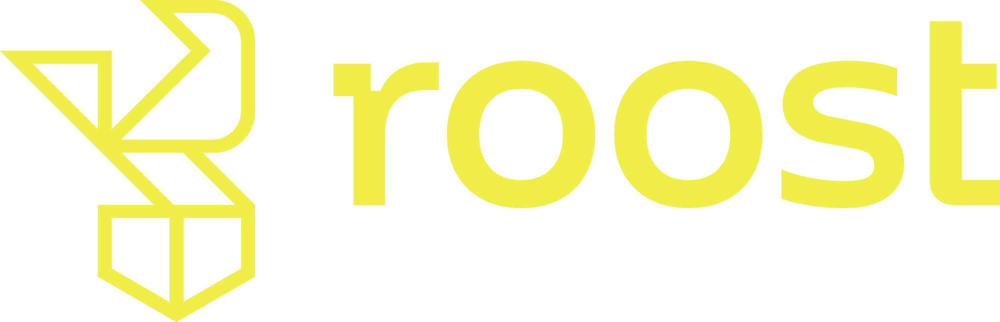

# Osprey

**Automate the obvious and investigate the ambiguous.** Osprey is a safety rules engine and investigation console for real-time event processing at scale.

Your platform streams events to Osprey, and human-written rules evaluate each one as it arrives—taking automatic action, applying labels to the entities involved, and sending verdicts and custom effects to your own systems. Analysts then query and chart the results to spot patterns, investigate, and turn what they find into new rules. Originally developed internally at [Discord](https://discord.com/) to combat spam, abuse, botting, and scripting across its platform, Osprey has been open-sourced to help other platforms facing similar challenges.


Rules are written in SML, Osprey's structured rule language, and extended with user-defined functions (UDFs). Osprey tracks state across events by labeling entities when you provide a labels service backend; see [labels_service.py](./example_plugins/src/services/labels_service.py) for a Postgres-backed example.

Osprey is built for engineers and Trust & Safety teams who want to explore, test, and integrate it into their platform for incident response and investigations. [Read more about user research and personas](docs/research-personas.md).

## Try it

If you have Docker with Compose v2, one command brings up the full stack with sample data and opens the UI on a pre-filled query:

```sh
./demo.sh
```

Or, without cloning the repo first:

```sh
curl -sSL https://raw.githubusercontent.com/roostorg/osprey/main/demo.sh | bash
```

The [Getting Started guide](https://roostorg.github.io/osprey/latest/development/) explains what the demo starts, what to try in the UI, and how to shut it all down. The rest of the documentation lives at [roostorg.github.io/osprey/latest](https://roostorg.github.io/osprey/latest/).

## Adopters

Osprey is used by:

[](https://bsky.social) | [](https://discord.com) | [](https://matrix.org)
--- | --- | ---

Using Osprey and want to add your project/organization to this list? [Open a pull request!](https://github.com/roostorg/osprey/edit/main/README.md)

## Development

See the [development guide](./docs/development/) for development setup and workflow documentation, including the linting, type checking, and pre-commit hooks that changes are expected to pass.

## Join us

Writing code is not the only way to help the project. Reviewing pull requests, answering questions in issues and discussions, providing feedback from a domain expert perspective, teaching tutorials, and improving the documentation are all priceless contributions.

- Join us in [our Discord server](https://discord.gg/5Csqnw2FSQ)
- Join our [newsletter](https://roost.tools/#get-started) for more announcements and information
- Follow us on [Bluesky](https://bsky.app/profile/roost.tools) or [LinkedIn](https://www.linkedin.com/company/roost-tools/)

_[ROOST](https://roost.tools) (Robust Open Online Safety Tools) is a non-profit organization that brings together expertise, resources, and investments from major technology companies and philanthropies to build scalable, interoperable safety infrastructure for the AI era._

### Feedback wanted

This is a working system, not a prototype. Try it locally, connect your data, write some rules, and tell us what's missing for your use case. We're particularly interested in:

- Integration challenges with your existing platform infrastructure
- Performance characteristics with your event volumes and rule complexity
- Missing detection capabilities or response actions you need
- API improvements that would make adoption easier for your team

Your feedback will directly shape future priorities and help us build the most useful Trust & Safety tooling for the community.

## Recognition

Discord uses Osprey to quickly detect and remove new types of harm that put users at risk. Rather than leaving other platforms to build similar tools from scratch, ROOST and Discord have open-sourced Osprey in collaboration with [internet.dev](https://internet.dev/) to make it available for anyone who needs it.
