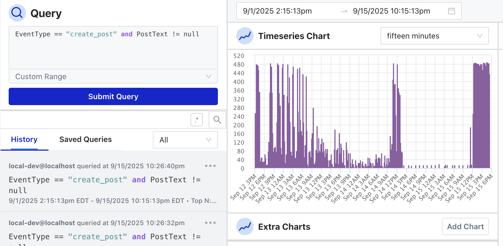

# Osprey

**Automate the obvious and investigate the ambiguous.** Osprey is a safety rules engine and investigation console for real-time event processing at scale.

Your platform streams events to Osprey, and human-written rules evaluate each one as it arrives—taking automatic action, applying labels to the entities involved, and sending verdicts and custom effects to your own systems. Analysts query and chart the results to spot patterns, investigate, and turn what they find into new rules.

Originally developed internally at [Discord](https://discord.com/) to combat spam, abuse, botting, and scripting across its platform, Osprey has been open sourced and is developed in the open by the [ROOST](https://roost.tools) community to help other platforms facing similar challenges.



Rules are written in SML, Osprey's structured rule language, and extended with user-defined functions (UDFs). Osprey tracks state across events by labeling entities when you provide a labels service backend; see [labels_service.py](./example_plugins/src/services/labels_service.py) for a Postgres-backed example.

Osprey is built for engineers and Trust & Safety teams who want to explore, test, and integrate it into their platform for incident response and investigations. [Read more about user research and personas]([docs/research-personas.md](https://roostorg.github.io/osprey/latest/research-personas).

## Quick start

If you have [Docker Compose](https://docs.docker.com/compose/install), get a demo running with sample data with one command:

```sh
curl -sSL https://raw.githubusercontent.com/roostorg/osprey/main/demo.sh | bash
```

See the [Getting Started guide](https://roostorg.github.io/osprey/latest/development/) for more, including what to try in the UI. See the [full documentation](https://roostorg.github.io/osprey/latest/) for a user guide, development setup, basic concepts, integration information, and more.

## Adopters

Osprey is used by:

[](https://bsky.social) | [](https://discord.com) | [](https://matrix.org)
--- | --- | ---

Using Osprey and want to add your project/organization to this list? [Open a pull request!](https://github.com/roostorg/osprey/edit/main/README.md)

### Built in the open

Osprey is an open source project undergoing active development. Features and documentation will evolve based on community feedback; we want to hear from you! Please [open an issue](https://github.com/roostorg/osprey/issues), [join or start a discussion](https://github.com/roostorg/osprey/discussions), or come chat with the community including developers and adopters in our [Discord server](https://discord.gg/2brrzbqgJF) to share.

Try it locally, connect your data, write some rules, and tell us what's missing for your use case. We're particularly interested in:

- Integration challenges with your existing platform infrastructure
- Performance characteristics with your event volumes and rule complexity
- Missing detection capabilities or response actions you need
- API improvements that would make adoption easier for your team

Your feedback directly shapes our [roadmap](https://roostorg.github.io/community/roadmap) and helps us build the most useful Trust & Safety tooling for the community.

## Recognition

Discord uses Osprey to quickly detect and remove new types of harm that put users at risk. Rather than leaving other platforms to build similar tools from scratch, ROOST and Discord have open-sourced Osprey in collaboration with [internet.dev](https://internet.dev/) to make it available for anyone who needs it.
