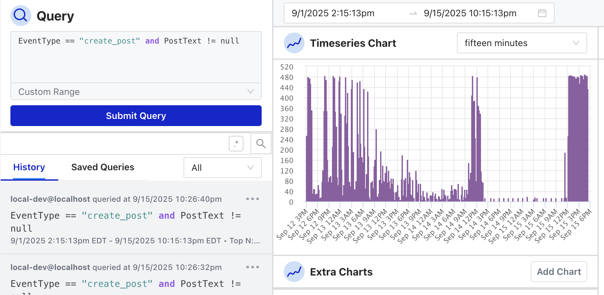

# Welcome

Osprey is an open source rules engine and investigation console for trust and safety teams: your platform streams events to it, your rules evaluate each one in real time, and your analysts query, chart, and act on the results. Originally built at Discord and running in production at Bluesky, Osprey is now developed in the open by [ROOST](https://roost.tools) and the community; visit [Osprey on GitHub](https://github.com/roostorg/osprey#readme) for source code and project information.

These docs are split into a few guides, depending on who you are and what you're looking for:

- [User Guide](user/): learn the investigation UI—querying events, labeling entities, and running bulk jobs.

- [Development Guide](development/): run a local development environment and change Osprey itself.

- [Integration Guide](integration/): connect Osprey to your platform—get data in and out, and extend it with plugins.

- [Concepts](concepts.md): learn about the basic concepts and terminology used in Osprey and these docs.

The docs are versioned; other versions are available at the [documentation site index](https://roostorg.github.io/osprey/).

The fastest way to get a feel for Osprey is the one-command demo in [Getting Started](development/), which brings up the full stack on live sample data in a few minutes.

## Contributing

Osprey is an open source project from [ROOST](https://roost.tools) and the community. We welcome contributions and benefit from diverse perspectives and expertise in building safer online spaces.

If you're new to the project, we recommend you:

- Read the [Code of Conduct](https://github.com/roostorg/.github/blob/main/CODE_OF_CONDUCT.md) to understand our community standards
- Review the [Contributing Guidelines](https://github.com/roostorg/.github/blob/main/CONTRIBUTING.md) for all ROOST projects
- Check out the [project board](https://github.com/orgs/roostorg/projects/13) for open issues, milestones, and prioritization

Writing code is not the only way to help the project. Reviewing pull requests, answering questions, providing feedback, organizing and teaching tutorials, and improving the documentation are all priceless contributions.

### Report an issue

Found a bug or have a feature request? We'd love to hear from you!

- Search [existing issues](https://github.com/roostorg/osprey/issues) to see if it's already been filed
- Create a [new issue](https://github.com/roostorg/osprey/issues/new) if it's unique

## Get help

If you need help with Osprey or want to get in touch, you are always welcome to:

- [Open a discussion](https://github.com/roostorg/osprey/discussions) with the community
- [Join our Discord server](https://discord.gg/2brrzbqgJF) to chat with contributors, adopters, and other community members
