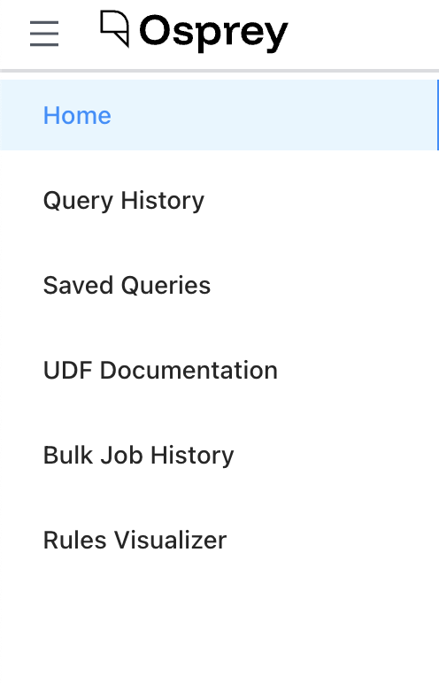
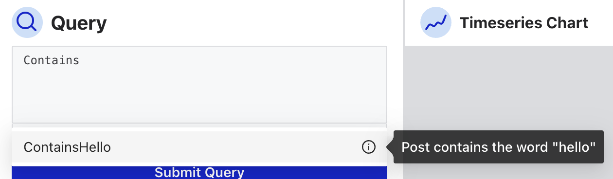
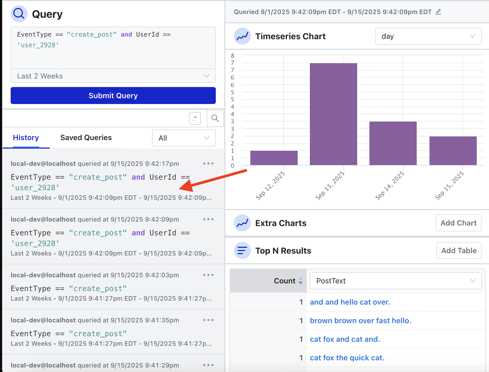
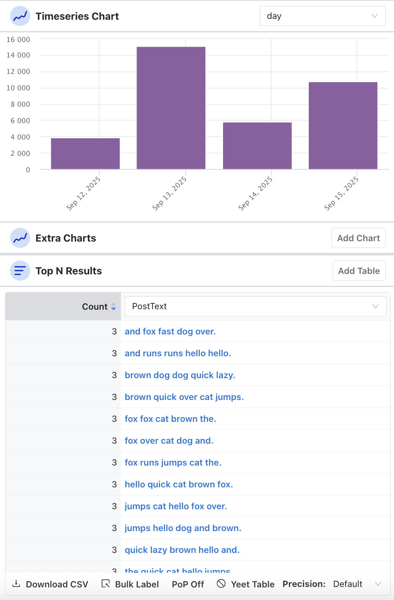
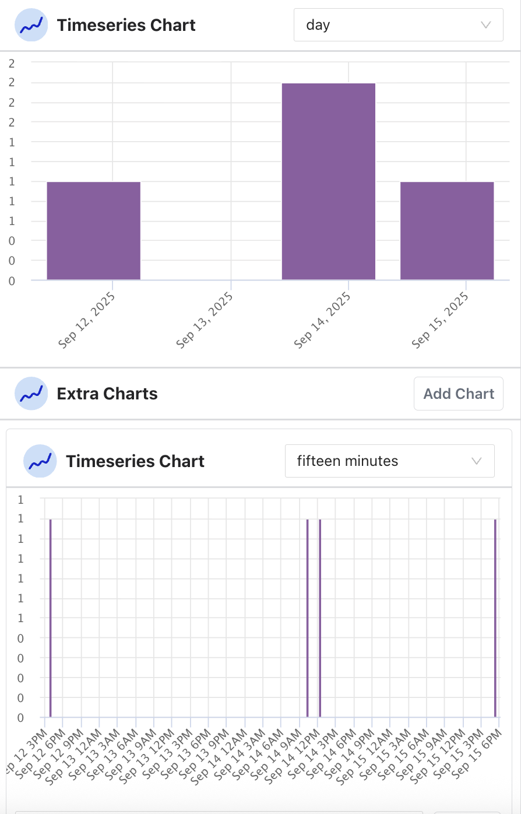
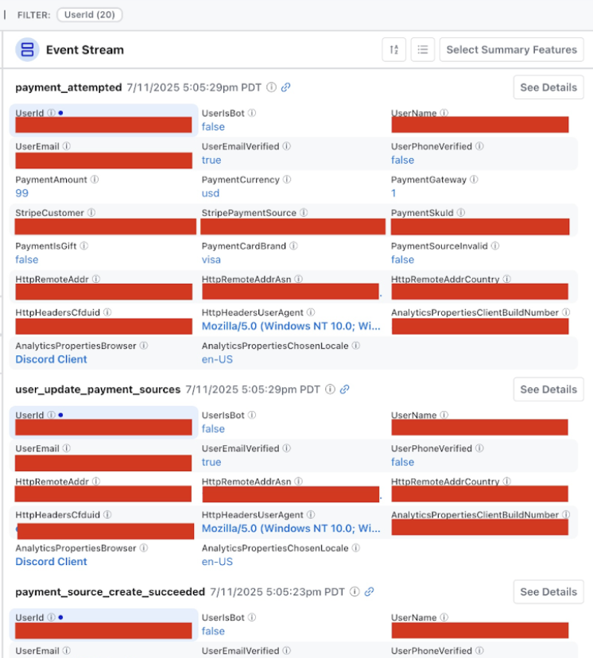
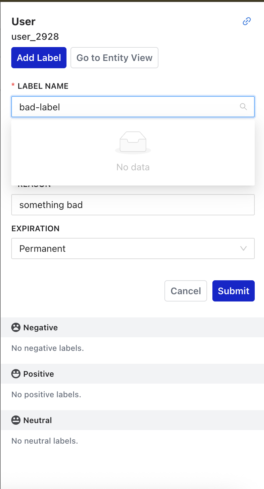
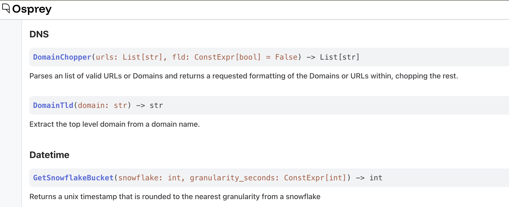

# **Osprey User Interface Guide**


## Getting Started

```bash
cd osprey_ui
npm install
npm start
```

The Osprey UI has several pages accessible by a left-hand menu:




Home will bring you to the default page of Osprey, with three main columns.

**NOTE: The Event Stream in the right column is not yet in v0, and will be available before or in v1.**


### Left Column: Query

#### **Query Box**

The Osprey Query UI uses the same SML syntax as rules, but for searching and filtering near-real-time and historical data rather than creating new rules. Using the test data generator, you can try writing a query to look for an action called “create\_post” specifically from a given User ID.


You can also use a UDF in your query. If you ever forget what a UDF does, you can hover on the information symbol for a tip:


A query can be run against a time window ranging from the last second to the last 3 months (and also a custom range):


The Osprey UI is designed to be dynamic and update in real-time. If any other component in the other two columns is interacted with, the query will automatically update and vice versa. The query also automatically populates the URL. This can be handy for sharing a specific query with someone on a team, but may present privacy risks.


#### **History**

Every query is logged in the Query History view, and there is a dropdown filter to only show queries that you have run.

When you hover over the query, it will also show the Top N Charts used during the query session (more on that below).



The Query History can also be accessed and seen in a different format via the left-side menu. From here you can filter by the user who ran the query, view the original query, and run it using the same time range the original query used.


#### **Saved Queries**

If there are specific queries that are used often, Osprey provides the ability to save a query:


The user who initiated the query and when the query was first run is logged as part of the Saved Query. Saved Queries can also be accessed via the left-side menu. The user who saved the query and what time it was saved is logged and visible. There is a drop-down menu at the top to filter saved queries by users.


### Middle Column: Charts

The middle column in Osprey shows two types of charts: **Time Series** and **Top N Results**. Both sections provide the ability to add extra charts to see different slices of time or types of top results.



#### **Time Series Chart**

The Time Series chart shows a visualization of the results in the query over a period of time. The time ranges include:

* Minute
* Fifteen minutes
* Half hour
* Hour
* Day
* Week
* Month

Hovering over a bar in the time series chart shows how many events took place during that time.


There is also a time and date picker above the time series chart where you can set a custom range:


An extra table can be added for another view of a different unit of time. To get rid of the table, you can “[yeet](https://www.urbandictionary.com/define.php?term=Yeet) it”.



#### **Top N Results**

Adding a Top N Results table populates a table with the top results for the results of the query. You can view and assign labels to a specific entity by hovering over it and clicking “Edit Labels”


**NOTE: Labels are not yet in v0**


You can also select PoP (Period over Period) to compare the query results with results from a window of time in the past to see the delta.


### Right Column: Event Stream

**The Event Stream is not yet in v0, and will be available before or in v1.**

The Event Stream is essentially Osprey's "live feed" and investigation dashboard where security teams can:

* Monitor real-time activity
* Search historical events using SML queries
* Investigate suspicious patterns
* Track rule execution results
* Drill down into specific users/entities

It provides a more detailed view of each event that matches the query. The Event Stream can show metadata related to accounts that can link to other internal tools that provide detailed information about an account and/or further enforcement actions.



The event stream is also viewable in a card format vs a list format (list format shown in the screenshot).

Osprey users may have personal preferences on how to do investigations and what information is most helpful for them. Osprey makes it easy to customize the types of information shown in the Event Stream by clicking “Summary Features”


### Labeling

**Note: Labels are not yet in v0, but will come in v1**
Any unique entity can be labeled in the Osprey UI. This manual labeling tool is used by Safety teams to tag individual entities (users, IPs, emails, etc.) with labels. Labels are essentially the manual annotation tool that feeds into Osprey's automated rule system, allowing human judgment to enhance machine detection. Labels can be positive, negative, or neutral. Examples:

**Negative Labels: Harmful/problematic behavior**
* Examples: "spammer", "bot", "banned", "suspicious"

**Positive Labels: Good/trusted behavior**
* Examples: "verified", "trusted", "premium\_user"

**Neutral Labels: Informational tags**
* Examples: "new\_user", "from\_mobile", "beta\_tester"


Below are examples of a new label interface from v0, and an example from Discord’s usage of labels (coming in v1).



### UDF Documentation

The UDF Documentation page can be accessed via the left-side menu. It dynamically updates based on the code, so any new UDFs added will show up on this page. This page essentially serves as the "API reference" for the SML language, making it easy for users to discover and properly use all available functions when writing rules and queries.


This page can be used as a manual for writing SML rules or queries, guide for understanding parameter types and requirements, and act as a plugin discovery portal to explore what custom UDFs are loaded.

### Bulk Labeling

**Note: Since Bulk Labeling relies on Labels, it does not yet work in v0.**

There are two ways to bulk label items in Osprey: the left-side menu and via the chart column. In this example, you can bulk label all the users that have posted a message that is not empty:


**Bulk labels can be dangerous if there’s a false positive\!** Osprey provides a counter of how many unique entities are about to be bulk labeled at the top. Labels can be positive, negative, or neutral. A reason must be provided when labeling anything. Each bulk job will create a unique task ID and log the user who initiated the bulk job, the status of the bulk labeling, and a link to the query that the bulk job originated from.

To view all bulk labeling jobs that have been done, click into “Bulk Job History” from the left-side menu. You’ll need the unique task ID to look up a bulk job.


### Rule Visualizer

**Note: Since the Rule Visualizer relies on Labels, it does not yet work in v0.**

The Rule Visualizer shows how upstream labels, rules, and downstream labels interact with one another. To use it, select an Action or a Label. A graph view will appear showing the relations between rules and labels.

* **Red circle:** label upstream of a rule
* **Blue square:** rule
* **Green circle:** label downstream of a rule


### Query Syntax

#### **Actions**

Actions are events that are sent to Osprey. An event is simply something that happens. When a user does something like create a post, send a message, change their username, etc an event happens to represent that. There are probably a lot of events emitted in your org, and Osprey doesn’t need to consume all of them.

##### Features

A feature is any variable in the global namespace in Osprey. All features must be uniquely named. However, prefixing a \`\_\` at the start of a variable name prevents it from being exported as a feature and keeps the variable within the local file’s namespace.

Features are outputs of Osprey executions. Downstream, they are sent to and indexed by Druid, so users can query for events based on feature names later, i.e. \`UserEmail \== '`` despicable@example.com` ``.

```py
UserId: Entity[int] = EntityJson(type='User', path='$.user.id', coerce_type=True)

UserEmail: str = JsonData(type='Email', path='$.user.email', required=False)
```

In the example above, both `UserId` and `UserEmail` are features.

##### Entities

Entities are a special type of Feature. All entities are features, but not all features are entities. An entity can have effects applied to it, such as labels, classifications, or signals). Every entity has a type that determines which effects can be applied to it based on static validations.

Entities get special treatment within the Osprey UI. Clicking on an entity in the tool will take you to an Entity View, providing a deep dive into its history.

This could be:

* User ID
* IP Address
* Post Text
* Internet Service Provider

#### **Effects**

Effects can be triggered when one or many rules are evaluated to be true. These are validated and handled in aggregate at the end of an execution output. For example, an effect might apply a label to an entity marking it as a “Spammer”.

### Basic Query Structure

Let’s say you have a data field called “EventType” and one of the events is to “create\_post”. You are looking for posts by a user whose ID is 12345 and you don’t want to see empty posts. Your query would look like:

```py
# Simple field comparisons
EventType == "create_post"
UserId == 12345
MessageText != Null
```

#### **Combining Conditions**

Let’s say you’re looking for any matches where a user tried to login more than 3 times. You can create a query to check for two types of data fields: “EventType” and “LoginAttempts”.

If you’re looking for multiple types of events in “EventType” like for posts AND messages, you can use brackets to list the types of events.

```py
 # Multiple conditions (AND)
  EventType == "user_login" and LoginAttempts >= 3

  # OR conditions
  EventType in ["create_post", "send_message"]
  (UserId == 123) or (UserId == 456)
```

#### **Using UDFs in Queries**

UDFs (read more [here](https://github.com/roostorg/osprey/blob/f16da6e5c32ae124c3cc6e2d7efded7cea1ac726/docs/rules.md#user-defined-functions-udfs)) are a powerful part of queries. Once you define a UDF with the specific desired logic, you can reference it in a query.

**NOTE: If you try to query a UDF that doesn’t exist, Osprey will silently fail with a 500 error.**

```py
 # Text search
  TextContains(text=PostContent, phrase="spam")
  RegexMatch(target=MessageText, pattern="(buy|sell|deal)")

  # List operations
  ListLength(list=UserConnections) > 10
```

#### **Label Queries**

**Important Note: Labels are not yet in v0, so these will not work in the UI.**

Since the UI searches across actions/events:

* **Don't use:** HasLabel() \- won't work in Query UI
* **Use instead**: DidAddLabel() \- shows when an action added a label

```py
  # Find actions that added specific labels
  DidAddLabel(entity_type="UserId", label_name="likely_spammer")
  DidAddLabel(entity_type="IpAddress", label_name="suspicious")
```

###

### Example Queries

```py
# Find suspicious login attempts:
  EventType == "user_login" and LoginAttempts >= 5

# Find posts containing specific words:
  EventType == "create_post" and TextContains(text=PostContent, phrase="urgent")

# Find users who were flagged:
  DidAddLabel(entity_type="UserId", label_name="flagged")

# Complex search:
  EventType == "send_message" and
  RegexMatch(target=MessageText, pattern="(click|link|urgent)") and
  not DidAddLabel(entity_type="UserId", label_name="verified")
