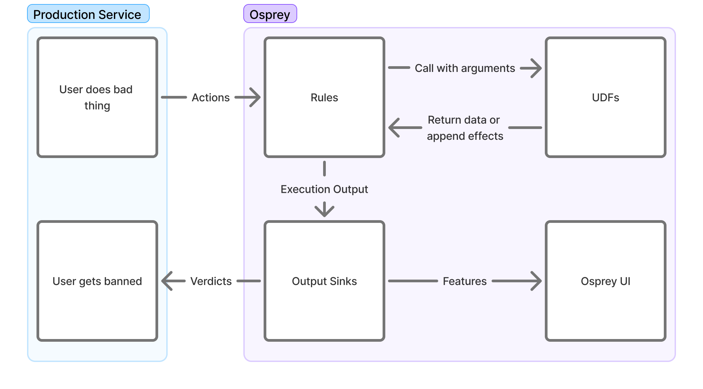

# Osprey Rules



## Creating Rules

Osprey rules are written in SML (Some Madeup Language) which is a subset of Python with additional restrictions to simplify rule writing. You may write rules that are specific to
single event types on a network, or ones that are applied to multiple event types.

By themselves, rules only create variables, and without a corresponding `WhenRules()` function call, the rule will have no effects outside of evaluation and query functionality.

Rules currently support the following concepts through the `Rule(...)` function of the same name.

- Name

    `Rule_Name = Rule(...)`

    The name of the rule also functions as a conventional "RuleId" and the name of the bool that can be used to query individual rule hits in the Osprey Query UI. As a result, changing the name of a rule after activation may affect historical query results in the UI if not logged externally.

- Logic

    `when_all=[]`

    The actual logic that will be used to evaluate Osprey rules is all encompassed as single comma-delimited list of signals within the `when_all` parameter of the `Rule(...)` function and supports the use of Labels, Plugins, UDFs and other values to help enrich heuristics.

    At present, when evaluating UDFs or abstracted variables, any `NULL` evaluations in the series will cause the entire rule function to evaluate as `NULL`, which may be undesirable.

- Description

    `description=f''`

    There is an additional string description field that is able to be emitted alongside the rule itself to external systems such as logging and ticketing systems to help enrich work-streams that may benefit from plain-language context on what the rule criteria is and what the rule may intend to do.

    It may be helpful to include dynamic variables as well to help enrich operational workflows that may need to identify specific values related to the trigger criteria.


An example is below of a simple rule using various signal evaluations and out-of-the-box UDFs.

```python
My_Rule_Name_v2 = Rule(
    when_all=[
        # Primary Signal
        MyFirstValue == True,
        HasLabel(entity=MyEntityName, label='MyLabel'),
        ListLength(list=UsersValues) == 5,
        # Secondary Signal
        RegexMatch(target=MyStringValue, pattern='(hello|world)'),
        MySecondValue >= 3,
        MyThirdValue != Null,
        # Guardrail Signal
        (_LocalValue in [1, 2, 3, 5]) or (GlobalValue in ['hello', 'howdy']),
        not HasLabel(entity=MySecondEntityName, label='MySecondLabel'),
    ],
    description=f"{UserA} performed {ActionB} in this way. Emit warning",
)
```

## Rule Structuring

You will likely find it useful to maintain two subdirectories inside of your main rules directory - a `rules` directory where actual logic will be added and a `models` directory for defining the various features that occur in any or specific event types. For example, your structure may look something like this:

```bash
example-rules/
|  rules/
|  |  record/
|  |  |  post/
|  |  |  |  first_post_link.sml
|  |  |  |  index.sml
|  |  |  like/
|  |  |  |  like_own_post.sml
|  |  |  |  index.sml
|  |  account/
|  |  |  signup/
|  |  |  |  high_risk_signup.sml
|  |  |  |  index.sml
|  |  index.sml
|  models/
|  |  record/
|  |  |  post.sml
|  |  |  like.sml
|  |  account/
|  |  |  signup.sml
|  main.sml
```

This sort of structure lets you define rules and models that are specific to certain event types so that only the necessary rules are run for various event types. For example, you likely have some rules that should only be run on a `post` event, since only a `post` will have features like `text` or `mention_count`.

Inside of each directory, you may maintain an `index.sml` file that will define the conditional logic in which the rules inside that directory are actually included for execution. Although you could handle all of this conditional logic inside of a single file, maintaining separate `index.sml`s per directory greatly helps with neat organization.

## Models

Before you actually write a rule, you'll need to define a "model" for an event type. For this example, we will assume that you run a social media website that lets users create posts, either at the "top level" or as a reply to another top level post. Each post may include text, mentions of other users on your network, and an optional link embed in the post. Let's say that the event's JSON structure looks like this:

```json
{
	"eventType": "userPost",
	"user": {
		"userId": "user_id_789",
		"handle": "carol",
		"postCount": 3,
		"accountAgeSeconds": 9002
	},
	"postId": "abc123xyz",
	"replyId": null,
	"text": "Is anyone online right now? @alice or @bob, you there? If so check this video out",
	"mentionIds": ["user_id_123", "user_id_456"],
	"embedLink": "https://youtube.com/watch?id=1"
}
```

Inside of our `models/record` directory, we should now create a `post.sml` file where we will define the features for a post.

```python
PostId: Entity[str] = EntityJson(
	type='PostId',
	path='$.postId',
)

PostText: str = JsonData(
	path='$.text',
)

MentionIds: List[str] = JsonData(
	path='$.mentionIds',
)

EmbedLink: Optional[str] = JsonData(
	path='$.embedLink',
	required=False,
)

ReplyId: Entity[str] = JsonData(
	path='$.replyId',
	required=False,
)
```

The [`JsonData` UDF](#user-defined-functions-udfs) lets us take the event's JSON and define features based on the contents of that JSON. These features can then be referenced in other rules that we import the `models/record/post.sml` model into. If you have any values inside your JSON object that may not always be present, you can set `required` to `False`, and these features will be `None` whenever the feature is not present.

Note that we did not actually create any features for things like `userId` or `handle`. That is because these values will be present in *any* event. It wouldn't be very nice to have to copy these features into each event type's model. Therefore, we will actually create a `base.sml` model that defines these features which are always present. Inside of `models/base.sml`, let's define these.

```python
EventType = JsonData(
	path='$.eventType',
)

UserId: Entity[str] = EntityJson(
	type='UserId',
	path='$.user.userId',
)

Handle: Entity[str] = EntityJson(
	type='Handle',
	path='$.user.handle',
)

PostCount: int = JsonData(
	path='$.user.postCount',
)

AccountAgeSeconds: int = JsonData(
	path='$.user.accountAgeSeconds',
)
```

Here, instead of simply using `JsonData`, we instead use the `EntityJson` UDF for the `UserID`. This is covered in the [UDFs section](#user-defined-functions-udfs), but as a rule of thumb, you likely will want to have values for things like a user's ID set to be entities. This will help more later, such as when doing data explorations within the Osprey UI.

### Model Hierarchy

In practice, you may find it useful to create a hierarchy of base models:

- `base.sml` for features present in every event (user IDs, handles, account stats, etc.)
- `account_base.sml` for features that appear only in account related events, but always appear in each account related event. Similarly, you may add one like `record_base.sml` for those features which appear in all record events.

This type of hierarchy prevents duplication (which Osprey does not allow) and ensures features are defined at the appropriate level of abstraction.

## Effects with WhenRules

The `WhenRules()` function allows for creating effects that trigger external services, create declarations, or modify internal labels by listing `Rule` objects in sequence within the
`rules_any` parameter of `WhenRules()`. By default, operators and designers may utilize UDFs with predefined effects such as `DeclareVerdict()`, `LabelAdd()`, or `LabelRemove()` upon
positive rule evaluation.

Below is an example of the use of a WhenRules() block to verify and email and reject a request.

```python
WhenRules(
    rules_any=[
        Enabled_Rule_1,
        Enabled_Rule_2,
        # Disabled_Rule_1,
    ],
    then=[
        # Verdicts
        DeclareVerdict(verdict='reject'),
        # Labels
        LabelAdd(entity=UserId, label='recently_challenged', expires_after=TimeDelta(days=7)),
        LabelAdd(entity=UserId, label='verify', apply_if=NotVerified),
        LabelAdd(entity=Email, label='pending_verify'),
        LabelAdd(entity=Domain, label='recently_seen', expires_after=TimeDelta(days=7)),
    ],
)
```

`WhenRules()` must be placed after rule declaration within a file, and it may become difficult to interpret outcomes of rules that are too distributed. Therefore, it may be beneficial
to place any effects toward the bottom of workflows.

## Output Sinks

After all rules are evaluated for an input event, a set of output sinks takes the resulting `ExecutionResult` and performs additional work based on that data. These may be defined
as part of a plugin for performing domain specific work.

Some default use cases include a `StdoutOutputSink` which simply outputs the result to the log, a `KafkaOutputSink` which pipes data to Kafka (used for Osprey UI), or the
`LabelOutputSink` which can add some stateful data to be used in future rules executions.

```python
class StdoutOutputSink(BaseOutputSink):
    """An output sink that prints to standard out!"""

    def __init__(self, log_sampler: Optional[DynamicLogSampler] = None):
        pass

    def will_do_work(self, result: ExecutionResult) -> bool:
        return True

    def push(self, result: ExecutionResult) -> None:
        print(f'result: {result.extracted_features_json} {result.verdicts}')

    def stop(self) -> None:
        pass
```

Passing data to these output sinks is standardized through the use of `Effects`, which are outputs of some functions, usually UDFs.

```python
def push(self, result: ExecutionResult) -> None:
    users_to_ban = result.effects[BanUserEffect]
    ban_users(users_to_ban)
```

## User Defined Functions (UDFs)

User Defined Functions (UDFs) are plugins written in Python that enable users of Osprey to extend and customize their use of the Osprey SML. UDFs are implemented as Python functions and are registered
as a plugin. They extend the `UDFBase` abstract base class with a set of arguments and an output. These will be executed whenever called in SML.

```python
# example_plugins/text_contains.py
class TextContainsArguments(ArgumentsBase):
    text: str
    phrase: str
    case_sensitive = False

class TextContains(UDFBase[TextContainsArguments, bool]):
    def execute(self, execution_context: ExecutionContext, arguments: TextContainsArguments) -> bool:
        escaped = re.escape(arguments.phrase)
        pattern = rf'\b{escaped}\b'
        flags = 0 if arguments.case_sensitive else re.IGNORECASE
        regex = re.compile(pattern, flags)
        return bool(regex.search(arguments.text))

# example_plugins/register_plugins.py
@hookimpl_osprey
def register_udfs():
    return [TextContains]
```

Usage in SML:

```python
# example_rules/post_contains_hello.sml
ContainsHello = Rule(
  when_all=[
    EventType == 'create_post',
    TextContains(text=PostText, phrase='hello'),
  ],
  description='Post contains the word "hello"',
)
```

### Effect UDFs

Plugins may also define external effects, which are useful for performing functionality in your primary service. Effects are simply passed to output sinks at the end of a rule run.
These UDFs have an output that extends `EffectBase`, and can be called as a result of a `WhenRules`.

```python
# example_plugins/src/ban_user.py
class BanUser(UDFBase[BanUserArguments, BanUserEffect]):
    category = UdfCategories.ENGINE

    def execute(self, execution_context: ExecutionContext, arguments: BanUserArguments) -> BanUserEffect:
        return BanUserEffect(
            entity=arguments.entity,
            comment=arguments.comment,
        )

# example_rules/post_contains_hello.sml
WhenRules(
  rules_any=[ContainsHello],
  then=[BanUser(entity=UserId, comment='User said "hello"')],
)
```

UDF outputs can also implement the `CustomExtractedFeature` interface - which get persisted in the outputs for the UI. `EffectToCustomExtractedFeatureBase` can also be used when effects need additional processing for use in the UI.

## Labels

Labels are a standard plugin that enable stateful rules, and touch many parts of Osprey. They are effectively tags on various entities, which may be arbitrarily defined.

### Creating Entities

Labels are applied to Entities, which are dynamically interpreted from outputs of the UDF `EntityJson`, usually applied to pieces of data that are generally consistent across actions such as User ID or email.

```python
# user.sml
UserId: Entity[str] = EntityJson(
  type='User',
  path='$.user_id'
)
```

It is possible to create new UDFs that also create entities by having the output of UDF set to `EntityT`.

### Adding Labels

Labels may be added in a `WhenRules()` clause. This will cause the labels output sink to tag the given entity with the given label at the end of the rules run.

```python
WhenRules(
    rules_any=[
        Sent_Too_Many_DMs,
    ],
    then=[
        LabelAdd(entity=UserId, label='likely_spammer')
    ],
)
```

### Using Labels

Since labels may be retrieved during a rule run, they can be effectively used as state for your rules.

```python
Should_Warn_User_Of_Spammer = Rule(
    when_all=[
        HasLabel(entity=UserId, label='likely_spammer'),
        This_Is_A_New_DM,
    ],
)
```

Labels will also be shown in the UI for entities, and can also be set manually. Note that since the UI only searches across actions, `HasLabel()` will not work in the Query UI.
Instead, you may use `DidAddLabel`, which will be true when the given action added a label to a specific entity.

```python
# UI Query
DidAddLabel(entity_type="UserId", label_name="likely_spammer")
```

## Notable Gotchas

### Nulls

Nulls are the case where a rule or variable in SML does not exist. This can occur for many reasons - either a piece of data is missing or a rule didn't run. Unlike many programming languages, generally rules with null valued variables will not evaluate that rule (and thus, downstream rules will not evaluate either). The exception cases are when nulls are explicitly checked in a rule. For example:

```python
Thing: int = JsonData(path='$.property_that_doesnt_exist')

# Evaluates to False
MyFirstRule = Rule(when_all=[
    Thing != Null,
])

# Skips evaluation and sets to Null
MySecondRule = Rule(when_all=[
    Thing > 1,
])

# Skips evaluation and sets to Null
MyThirdRule = Rule(when_all=[
    MySecondRule,
])
```

### Workflow Structure and File Placement

SML files can be composed to make your rules easier to understand. The `Import` statement allows you to include rules and variables found in other files.

```python
# models/action_name.sml
ActionName = "foo"

# main.sml
Import(
    rules=[
        'models/action_name.sml',
        'models/http_request.sml',
    ]
)

MyRule = Rule(when_all=[ActionName == "foo"])
```

`Require` allows you to selectively run other SML scripts. Requires supports templating and conditionals, allowing scripts to be filtered out if necessary. This is important in situations where some rules or UDFs are particularly expensive to run (such as making a call to an AI service, for example).

```python
# main.sml
Require(rule=f'actions/{ActionName}.sml')  # will execute 'actions/foo.sml'

Require(rule='ai_services/my_ai_service.sml', require_if=ActionName == "register")
```

## Full Example

The following is a complete walkthrough of writing a rule using the project structure described above. The goal is to flag accounts whose first post mentions at least one user and includes a link.

### Writing the Rule

We'll create `rules/record/post/first_post_link.sml` for the rule logic. This file defines both the conditions that cause the rule to evaluate to `True` and the actions to take when it does.

```python
# First, import the models that you will need inside of this rule
Import(
    rules=[
        'models/base.sml',
        'models/record/post.sml',
    ],
)

# Next, define a variable that uses the `Rule` UDF
FirstPostLinkRule = Rule(
    # Set the conditions in which this rule will be `True`
    when_all=[
        PostCount == 1, # if this is the user's first post
        EmbedLink != None, # if there is a link inside of the post
        ListLength(list=MentionIds) >= 1, # if there is at least one mention in the post
    ],
    description='First post for user includes a link embed',
)

# Finally, set which effect UDFs will be triggered
WhenRules(
    rules_any=[FirstPostLinkRule],
    then=[
        # This is a custom effect UDF that we have implemented
        ReportRecord(
            entity=PostId,
            comment='This was the first post by a user and included a link',
            severity=3,
        ),
    ],
)
```

### Wiring Up the Rule

We want this rule to run *only* when the event is a post event. Using the project structure described above, this involves three files.

First, `main.sml` at the project root includes a single `Require` statement pointing to the top-level rules index:

```python
Require(
    rule='rules/index.sml',
)
```

Next, `rules/index.sml` conditionally requires the post rules when the event type matches:

```python
Import(
    rules=[
        'models/base.sml',
    ],
)

Require(
    rule='rules/record/post/index.sml',
    require_if=EventType == 'userPost',
)
```

Finally, `rules/record/post/index.sml` requires the new rule:

```python
Import(
    rules=[
        'models/base.sml',
        'models/record/post.sml',
    ],
)

Require(
    rule='rules/record/post/first_post_link.sml',
)
```
