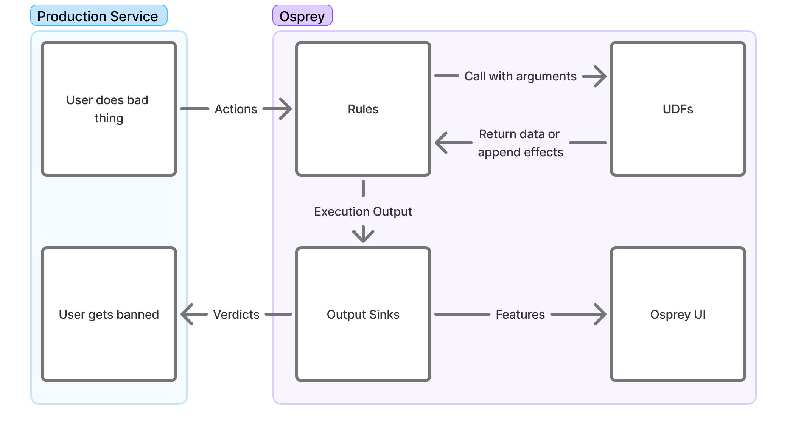

# Writing Rules

Rules are how you teach Osprey what to look for and what to do when it finds it. This page covers SML ("Some Madeup Language"), Osprey's rule language: defining features with models, writing rules over them, and wiring rules to effects.

See also: 
  - [Examples](examples.md) to apply all the concepts to complete, runnable rulesets
  - [Why a Bespoke Language?](why-sml.md) for more about SML and why it exists



## Creating Rules

Osprey rules are written in SML, a subset of Python with additional restrictions to simplify rule writing. You may write rules that are specific to single event types on a network, or ones that are applied to multiple event types.

By themselves, rules only create variables; without a corresponding `WhenRules()` function call, the rule will have no effects outside of evaluation and query functionality.

Rules currently support the following concepts through the `Rule(...)` function of the same name:

- **Name**

  `Rule_Name = Rule(...)`

  The name of the rule also functions as a conventional "RuleId" and the name of the bool that can be used to query individual rule hits in the Osprey Query UI. As a result, changing the name of a rule after activation may affect historical query results in the UI if not logged externally.

- **Logic**

  `when_all=[]`

  The actual logic that will be used to evaluate Osprey rules is all encompassed as single comma-delimited list of signals within the `when_all` parameter of the `Rule(...)` function and supports the use of Labels, Plugins, UDFs and other values to help enrich heuristics.

    At present, when evaluating UDFs or abstracted variables, any `NULL` evaluations in the series will cause the entire rule function to evaluate as `NULL`, which may be undesirable.

- **Description**

  `description=f''`

  There is an additional string description field that is able to be emitted alongside the rule itself to external systems such as logging and ticketing systems to help enrich work-streams that may benefit from plain-language context on what the rule criteria is and what the rule may intend to do.

    It may be helpful to include dynamic variables as well to help enrich operational workflows that may need to identify specific values related to the trigger criteria.


Here's an example of a simple rule using various signal evaluations and out-of-the-box UDFs:

```python
My_Rule_Name_v2 = Rule(
    when_all=[
        # Primary Signal
        MyFirstValue == True,
        HasLabel(entity=MyEntityName, label='MyLabel'),
        ListLength(list=UsersValues) == 5,
        # Secondary Signal
        RegexMatch(target=MyStringValue, pattern='(hello|world)'),
        MySecondValue >= 3,
        MyThirdValue != Null,
        # Guardrail Signal
        (_LocalValue in [1, 2, 3, 5]) or (GlobalValue in ['hello', 'howdy']),
        not HasLabel(entity=MySecondEntityName, label='MySecondLabel'),
    ],
    description=f"{UserA} performed {ActionB} in this way. Emit warning",
)
```

## Rule Structuring

You will likely find it useful to maintain two subdirectories inside of your main rules directory: a `rules` directory where actual logic will be added, and a `models` directory for defining the various features that occur in any or specific event types. For example, your structure may look something like this:

```bash
example-rules/
|  rules/
|  |  record/
|  |  |  post/
|  |  |  |  first_post_link.sml
|  |  |  |  index.sml
|  |  |  like/
|  |  |  |  like_own_post.sml
|  |  |  |  index.sml
|  |  account/
|  |  |  signup/
|  |  |  |  high_risk_signup.sml
|  |  |  |  index.sml
|  |  index.sml
|  models/
|  |  record/
|  |  |  post.sml
|  |  |  like.sml
|  |  account/
|  |  |  signup.sml
|  main.sml
```

The `main.sml` file at the root of your rules directory serves as the entry point. It uses `Import` and `Require` statements to control which other files are loaded and when, allowing you to compose together logic across the project. This sort of structure lets you define rules and models that are specific to certain event types so that only the necessary rules are run for various event types. For example, you likely have some rules that should only be run on a `post` event, since only a `post` will have features like `text` or `mention_count`.

Inside of each directory, you may maintain an `index.sml` file that will define the conditional logic in which the rules inside that directory are actually included for execution. Although you could handle all of this conditional logic inside of a single file, maintaining separate `index.sml`s per directory greatly helps with neat organization.

See [Workflow Structure and File Placement](#workflow-structure-and-file-placement) for more on `Import` and `Require`.

## Models

Before you actually write a rule, you'll need to define a "model" for an event type. For this example, we will assume that you run a social media website that lets users create posts, either at the "top level" or as a reply to another top level post. Each post may include text, mentions of other users on your network, and an optional link embed in the post. Let's say that the event's JSON structure looks like this:

```json
{
	"eventType": "userPost",
	"user": {
		"userId": "user_id_789",
		"handle": "carol",
		"postCount": 3,
		"accountAgeSeconds": 9002
	},
	"postId": "abc123xyz",
	"replyId": null,
	"text": "Is anyone online right now? @alice or @bob, you there? If so check this video out",
	"mentionIds": ["user_id_123", "user_id_456"],
	"embedLink": "https://youtube.com/watch?id=1"
}
```

Inside of our `models/record` directory, we should now create a `post.sml` file where we will define the features for a post.

```python
PostId: Entity[str] = EntityJson(
	type='PostId',
	path='$.postId',
)

PostText: str = JsonData(
	path='$.text',
)

MentionIds: List[str] = JsonData(
	path='$.mentionIds',
)

EmbedLink: Optional[str] = JsonData(
	path='$.embedLink',
	required=False,
)

ReplyId: Entity[str] = EntityJson(
	type='PostId',
	path='$.replyId',
	required=False,
)
```

The [`JsonData` UDF](#user-defined-functions-udfs) lets us take the event's JSON and define features based on the contents of that JSON. These features can then be referenced in other rules that we import the `models/record/post.sml` model into. If you have any values inside your JSON object that may not always be present, you can set `required` to `False`, and these features will be `None` whenever the feature is not present.

Note that we did not actually create any features for things like `userId` or `handle`. That is because these values will be present in *any* event. It wouldn't be very nice to have to copy these features into each event type's model. Therefore, we will actually create a `base.sml` model that defines these features which are always present. Inside of `models/base.sml`, let's define these.

```python
EventType = JsonData(
	path='$.eventType',
)

UserId: Entity[str] = EntityJson(
	type='UserId',
	path='$.user.userId',
)

Handle: Entity[str] = EntityJson(
	type='Handle',
	path='$.user.handle',
)

PostCount: int = JsonData(
	path='$.user.postCount',
)

AccountAgeSeconds: int = JsonData(
	path='$.user.accountAgeSeconds',
)
```

Here, instead of simply using `JsonData`, we instead use the `EntityJson` UDF for the `UserID`. This is covered in the [UDFs section](#user-defined-functions-udfs), but as a rule of thumb, you likely will want to have values for things like a user's ID set to be entities. This will help more later, such as when doing data explorations within the Osprey UI.

### Model Hierarchy

In practice, you may find it useful to create a hierarchy of base models:

- `base.sml` for features present in every event (user IDs, handles, account stats, etc.)
- `account_base.sml` for features that appear only in account related events, but always appear in each account related event. Similarly, you may add one like `record_base.sml` for those features which appear in all record events.

This type of hierarchy prevents duplication (which Osprey does not allow) and ensures features are defined at the appropriate level of abstraction.

## Effects with WhenRules

The `WhenRules()` function allows for creating effects that trigger external services, create declarations, or modify internal labels by listing `Rule` objects in sequence within the `rules_any` parameter of `WhenRules()`. By default, operators and designers may utilize UDFs with predefined effects such as `DeclareVerdict()`, `LabelAdd()`, or `LabelRemove()` upon positive rule evaluation.

Below is an example of the use of a WhenRules() block to verify and email and reject a request.

```python
WhenRules(
    rules_any=[
        Enabled_Rule_1,
        Enabled_Rule_2,
        # Disabled_Rule_1,
    ],
    then=[
        # Verdicts
        DeclareVerdict(verdict='reject'),
        # Labels
        LabelAdd(entity=UserId, label='recently_challenged', expires_after=TimeDelta(days=7)),
        LabelAdd(entity=UserId, label='verify', apply_if=NotVerified),
        LabelAdd(entity=Email, label='pending_verify'),
        LabelAdd(entity=Domain, label='recently_seen', expires_after=TimeDelta(days=7)),
    ],
)
```

`WhenRules()` must be placed after rule declaration within a file, and it may become difficult to interpret outcomes of rules that are too distributed. Therefore, it may be beneficial to place any effects toward the bottom of workflows.

After evaluation, effects and the rest of the execution result are handed to your deployment's output sinks. [Data Flow](../integration/data-flow.md) covers where results go from there, and [Integrations & Plugins](../integration/integrations.md#configuring-output-sinks) covers adding output sinks of your own.

## User Defined Functions (UDFs)

Nearly every function on this page—`Rule`, `JsonData`, `EntityJson`—is a UDF: a function implemented in Python and made available to SML. Osprey ships a standard library of them, and your deployment's developers can register custom ones through plugins; writing a UDF in Python is covered in [Integrations & Plugins § Writing UDFs](../integration/integrations.md#writing-udfs).

The authoritative list of what's callable in _your_ deployment—with signatures, descriptions, and categories—is the in-app [UDF Registry](../user/manage.md#udf-registry). The standard library includes general-purpose helpers like `RegexMatch`, `ListLength`, `ParseInt` (numeric string to integer), `StringSlice` (substring by index range), and the `Hash*` family, plus engine functions like `GetActionName()` and `GetActionId()` for the name and ID of the event being processed, and `Experiment`/`ExperimentWhen` for bucketing entities so a rule can roll out to a slice of traffic.

Custom UDFs are called from SML like any other function. The demo ruleset's one rule is built on a custom `TextContains` UDF:

```python
# example_rules/rules/post_contains_hello.sml
ContainsHello = Rule(
  when_all=[
    EventType == 'create_post',
    TextContains(text=PostText, phrase='hello'),
  ],
  description='Post contains the word "hello"',
)
```

### Effect UDFs

Some UDFs don't return a value to compare against; they produce an **effect**, a structured output that Osprey's output sinks act on after evaluation—banning a user, reporting a post. Effect UDFs are called in the `then=` list of a `WhenRules()` block:

```python
# example_rules/rules/post_contains_hello.sml
WhenRules(
  rules_any=[ContainsHello],
  then=[BanUser(entity=UserId, comment='User said "hello"')],
)
```

Implementing an effect UDF (and the output sink that consumes it) is plugin work; see [Integrations & Plugins](../integration/integrations.md#udfs-with-side-effects).

## Labels

Labels are a standard plugin that enable stateful rules, and touch many parts of Osprey. They are effectively tags on various entities, which may be arbitrarily defined. Rules can add and remove labels as effects and check them as conditions, so past decisions inform future ones; [Examples § Labels as state](examples.md#labels-as-state) walks through that pattern end to end. For how labels behave in the UI, see [User Guide → Investigate → Labels](../user/investigate/labels.md).

### Creating Entities

Labels are applied to Entities, which are dynamically interpreted from outputs of the UDF `EntityJson`, usually applied to pieces of data that are generally consistent across events such as User ID or email.

```python
# user.sml
UserId: Entity[str] = EntityJson(
  type='User',
  path='$.user_id'
)
```

It is possible to create new UDFs that also create entities by having the output of UDF set to `EntityT`.

## Notable Gotchas

### Nulls

Nulls are the case where a rule or variable in SML does not exist. This can occur for many reasons - either a piece of data is missing or a rule didn't run. Unlike many programming languages, generally rules with null valued variables will not evaluate that rule (and thus, downstream rules will not evaluate either). The exception cases are when nulls are explicitly checked in a rule. For example:

```python
Thing: int = JsonData(path='$.property_that_doesnt_exist')

# Evaluates to False
MyFirstRule = Rule(when_all=[
    Thing != Null,
])

# Skips evaluation and sets to Null
MySecondRule = Rule(when_all=[
    Thing > 1,
])

# Skips evaluation and sets to Null
MyThirdRule = Rule(when_all=[
    MySecondRule,
])
```

### Workflow Structure and File Placement

SML files can be composed to make your rules easier to understand. The `Import` statement allows you to include rules and variables found in other files.

```python
# models/action_name.sml
ActionName = "foo"

# main.sml
Import(
    rules=[
        'models/action_name.sml',
        'models/http_request.sml',
    ]
)

MyRule = Rule(when_all=[ActionName == "foo"])
```

`Require` allows you to selectively run other SML scripts. Requires supports templating and conditionals, allowing scripts to be filtered out if necessary. This is important in situations where some rules or UDFs are particularly expensive to run (such as making a call to an AI service, for example).

```python
# main.sml
Require(rule=f'actions/{ActionName}.sml')  # will execute 'actions/foo.sml'

Require(rule='ai_services/my_ai_service.sml', require_if=ActionName == "register")
```

---

See [Examples](examples.md) to put these concepts together into complete rulesets you can run and adapt.
