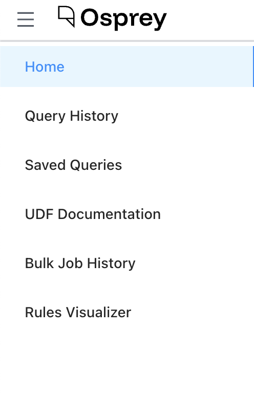

# Osprey User Interface

The Osprey UI is a web-based investigation and management console for safety teams. It lets you query event data in real time, visualize trends, label entities, manage rules and features, and run bulk operations — all from a single interface.

## Navigation

The left sidebar is the primary way to move between pages. It groups pages into three sections that reflect different working modes:

**Investigate** — tools for querying events and examining entity behavior:
- [Query](investigate.md#query) — the main investigation page
- [Query History](investigate.md#query-history) — browse and re-run past queries
- [Saved Queries](investigate.md#saved-queries) — manage frequently used queries

**Manage** — tools for understanding and navigating your rule and feature configuration:
- [Rules Visualizer](manage.md#rules-visualizer) — graph view of label/rule relationships
- [UDF Registry](manage.md#udf-registry) — API reference for all available functions
- [Features](manage.md#features) — inventory of all features in the system
- [Rules](manage.md#rules) — inventory of all rules in the system

**Operate** — tools for running and reviewing bulk operations:
- [Bulk Actions](operate.md#bulk-actions) — start and monitor bulk labeling jobs
- [Bulk Job History](operate.md#bulk-job-history) — review past bulk jobs and their results

The sidebar can be collapsed to a narrow icon-only strip using the toggle at the bottom. Its state persists between sessions.

## Theme

A light/dark mode toggle is available in the top bar. Your preference is saved and persists between sessions.
