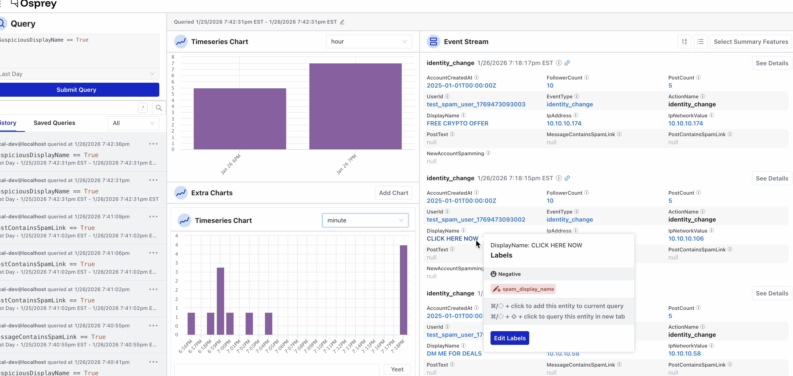
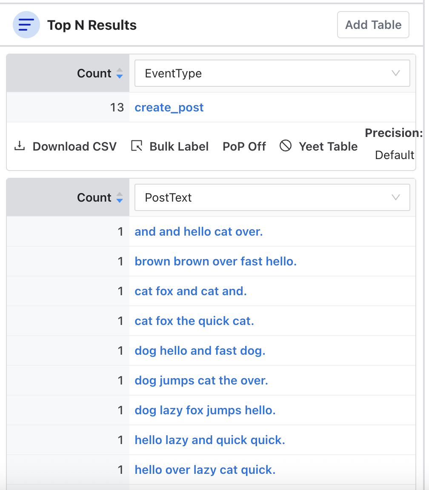

# User Guide

Osprey is a web-based investigation and management console for safety teams. Query event data in real time, visualize trends, label entities, manage rules and features, and run bulk operations.

The sidebar groups Osprey's tools by task, and this guide follows the same sections:

- **[Investigate](investigate/)**: query events in real time, chart the results, and drill into individual events and entities. Query history and saved queries let you revisit and share past investigations.

  

- **[Manage](manage.md)**: browse the rules, features, and UDFs configured in your deployment, and visualize how rules and labels relate.

  

- **[Operate](operate.md)**: run bulk labeling jobs over query results and review past jobs.

  

The sidebar can be collapsed to an icon-only strip with the toggle at the bottom, and its state persists between sessions. The interface supports light and dark themes; see [Appearance](appearance.md) for details.
