# Investigate

The Investigate section is where most day-to-day work happens. It contains the main query interface, your query history, and saved queries.

## Query

The Query page is the home page of Osprey. It's a live investigation workspace with three panels.

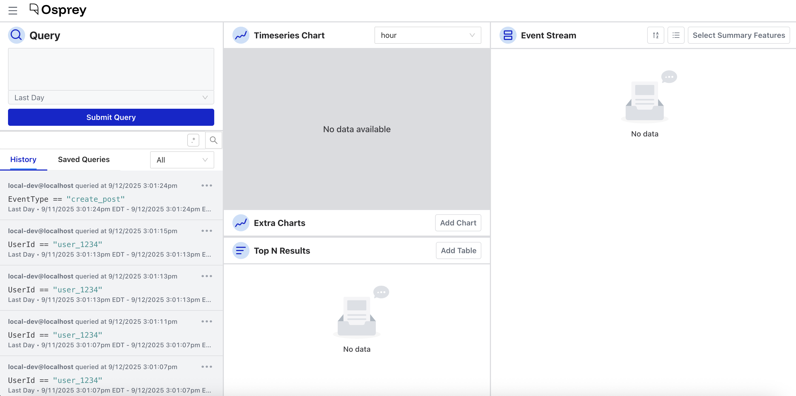

### Query input

The left panel is where you write and run queries. Osprey uses SML syntax—the same language used to write rules—to filter and search event data. See [Query Syntax](query-syntax.md) for a full reference.

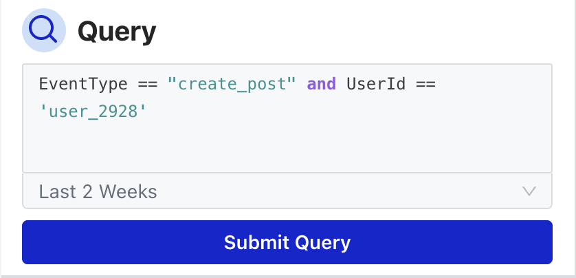

As you type, the input offers autocomplete suggestions for feature names, action names, and UDFs. Hovering over any UDF name shows a tooltip with its description.

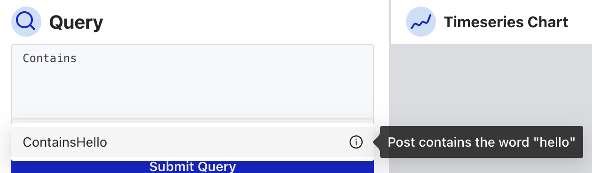

The active query is reflected in the page URL, making it easy to share a specific investigation with a teammate, though be aware this may expose sensitive query parameters.

### Time range

Every query runs against a time window. You can choose a preset interval—from the last second up to the last three months—or set a custom date range using the date picker.

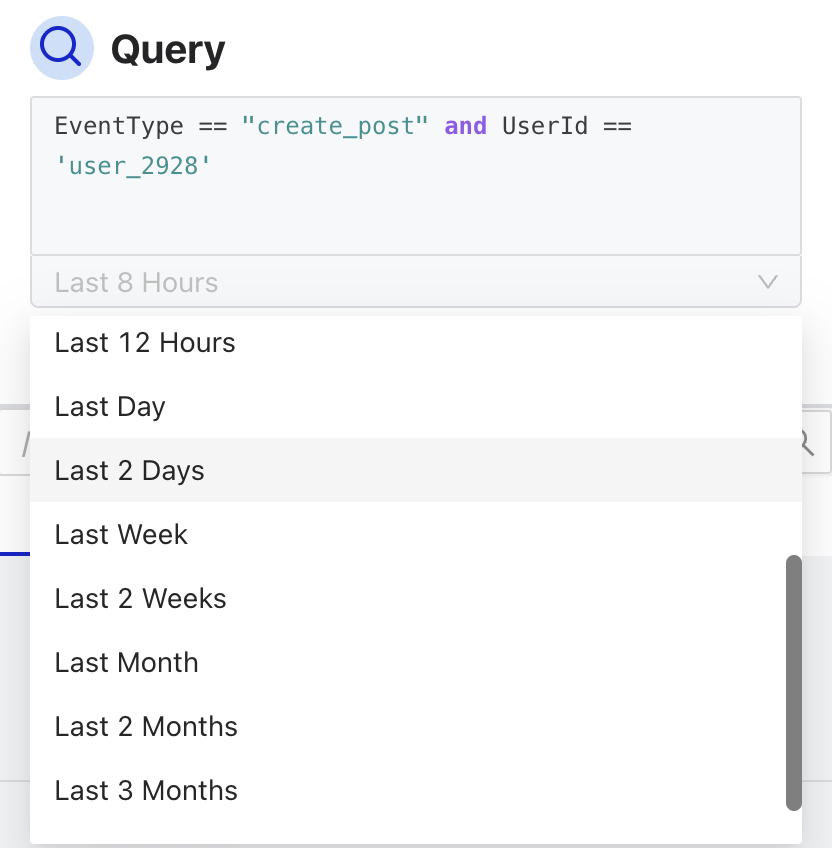

The entire page updates dynamically when the query or time range changes, and interacting with any other panel (charts, event stream) can also update the query in turn.

### Charts

The center panels show two types of visualizations:

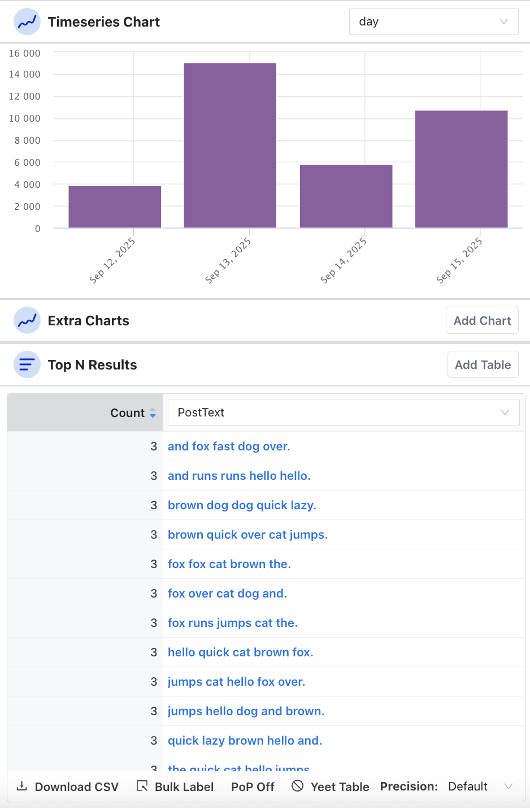

**Timeseries** displays how many matching events occurred over time. You can set the granularity—minute, fifteen minutes, half hour, hour, day, week, or month—and hover over individual bars to see the count for that period.

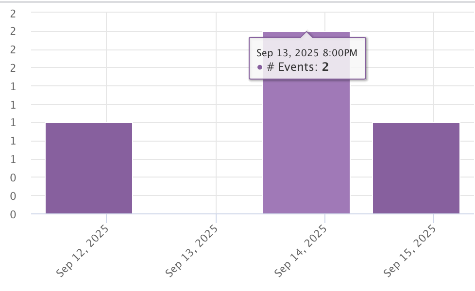

You can add additional timeseries charts to compare different time granularities side-by-side. Charts you no longer need can be removed with the **Yeet** button.

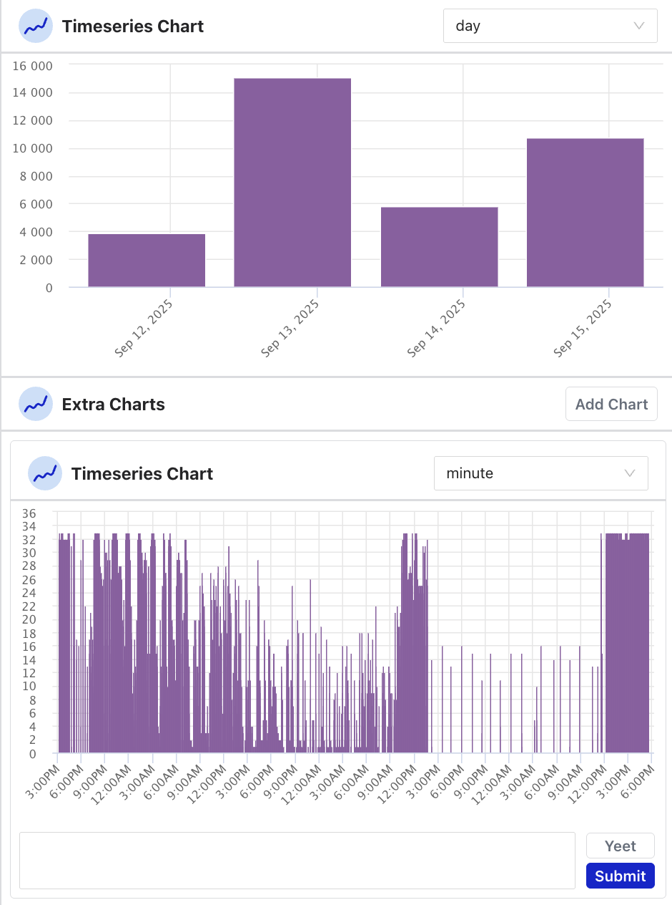

**Top N** shows a table of the top results for the current query, grouped by a dimension you choose. You can:
- Add or remove dimension columns
- Adjust the number of results shown (precision)
- Enable **Period over Period (PoP)** to compare current results against a past time window and see the delta
- Export the table as a CSV
- Remove the table with the **Yeet Table** button

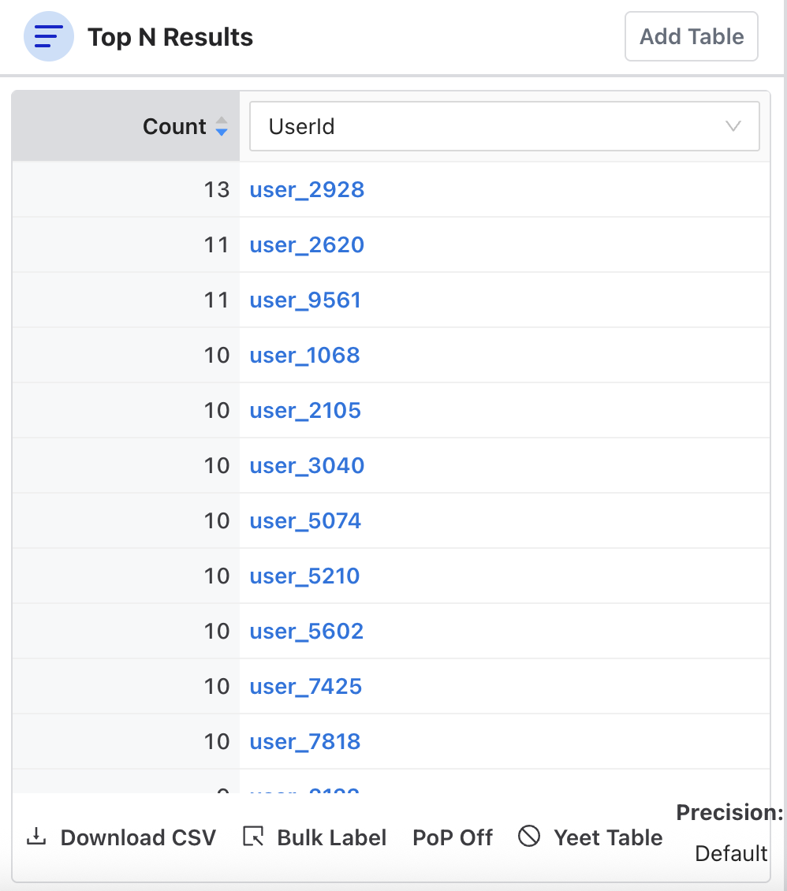

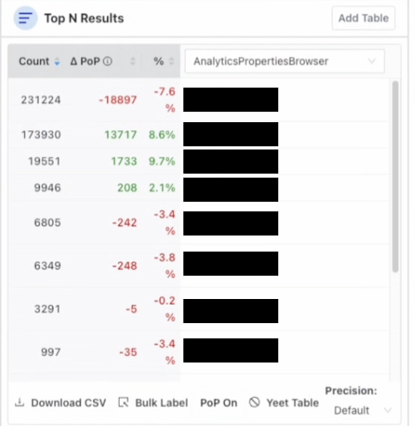

### Event stream

The right panel is Osprey's live feed. It shows individual events matching the current query in near-real time, and can also be used to search historical events.

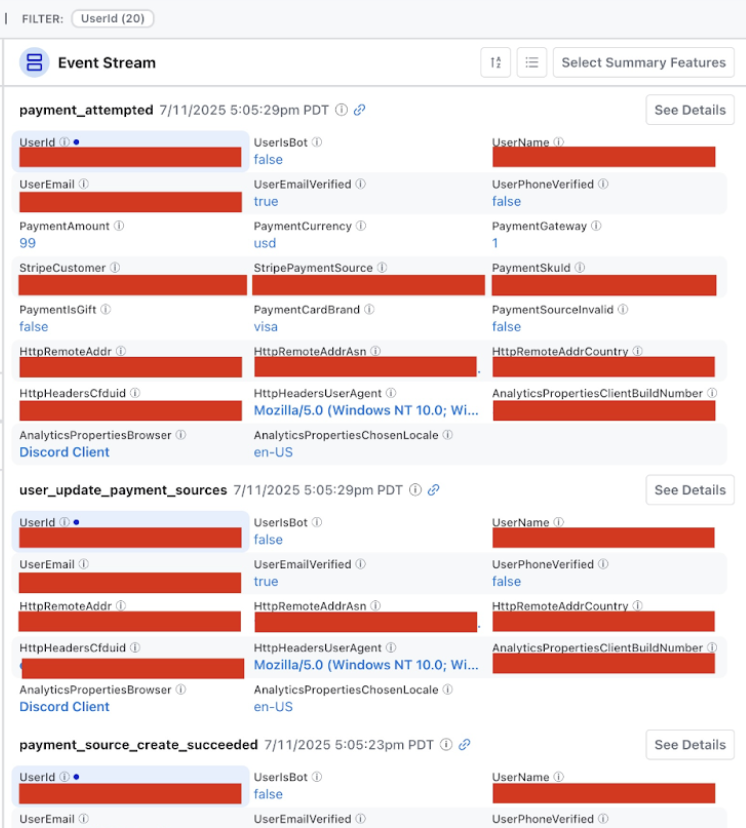

The stream can be displayed in card format or list format. On first load, each event card shows all of its extracted features (or the summary features configured for that event type, if any), so the stream is useful before you've set anything up. You can customize which fields appear per event with **Select Summary Features**, helpful when different team members care about different metadata.

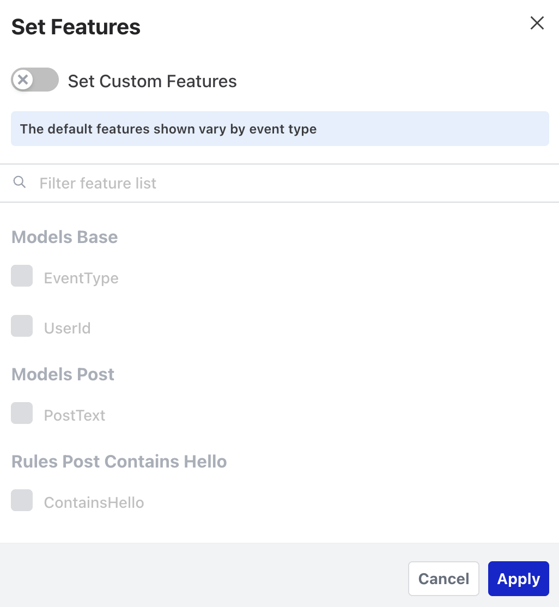

Selecting an entity in the event stream (such as a user ID or IP address) opens the [Entity Details](labels.md#entity-details) view. Hold <kbd>Ctrl</kbd> (<kbd>⌘ Cmd</kbd> on macOS) while clicking to select multiple events for bulk labeling.

Selecting an event opens a detail view at `/events/:eventId` showing all extracted feature values for that specific event.

## Query History

Every query you run is automatically saved to your history.

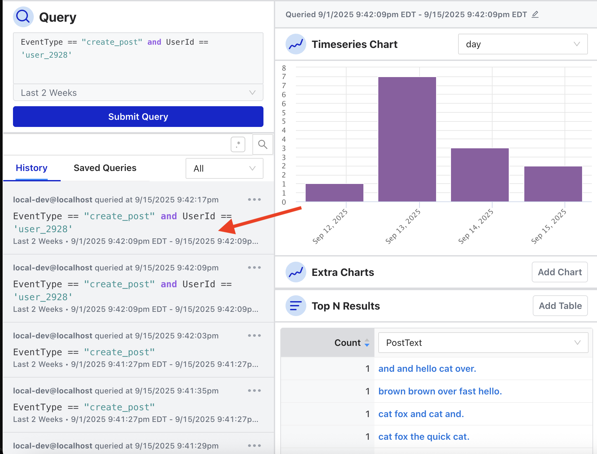

Hovering over a query in the sidebar shows the Top N dimensions that were active during that session.

The full Query History page (accessible from the sidebar) shows a searchable list of all queries run across your team. You can filter by user email, view the original query text, and re-run any past query using the same time range it was originally run with.

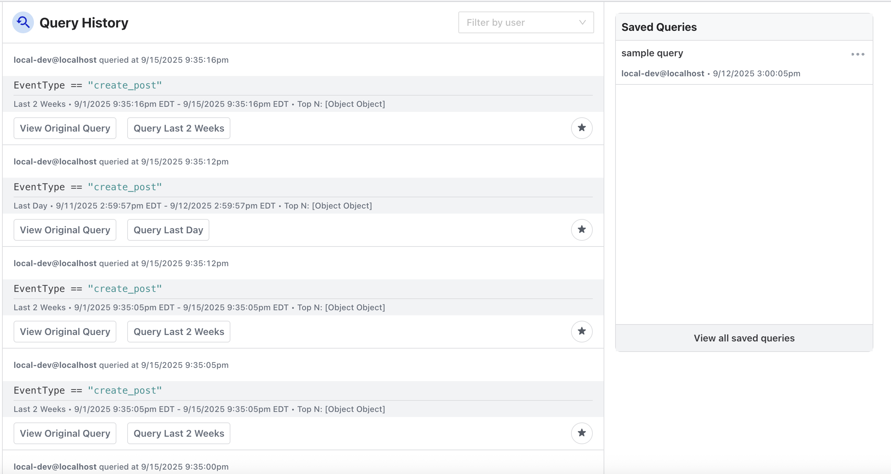

## Saved Queries

For queries you return to frequently, Osprey lets you save them by name.

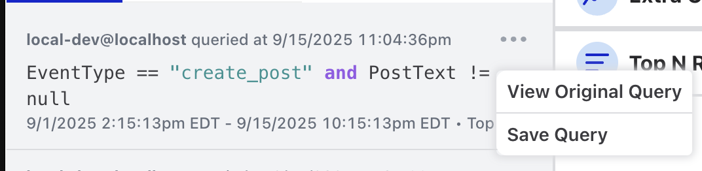

The Saved Queries page (accessible from the sidebar) shows a grid of all saved queries with the query text, the user who saved it, and when it was saved. You can filter by user email.

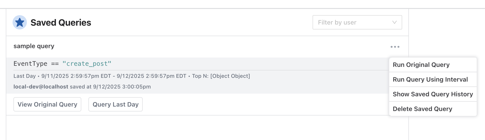

From the grid, you can:
- **Run** a saved query to load it into the Query page
- **Rename** it via an edit modal
- **Delete** it (with a confirmation step)

Saved queries also have a direct URL: `/saved-query/:savedQueryId/latest` automatically loads and executes the query.
