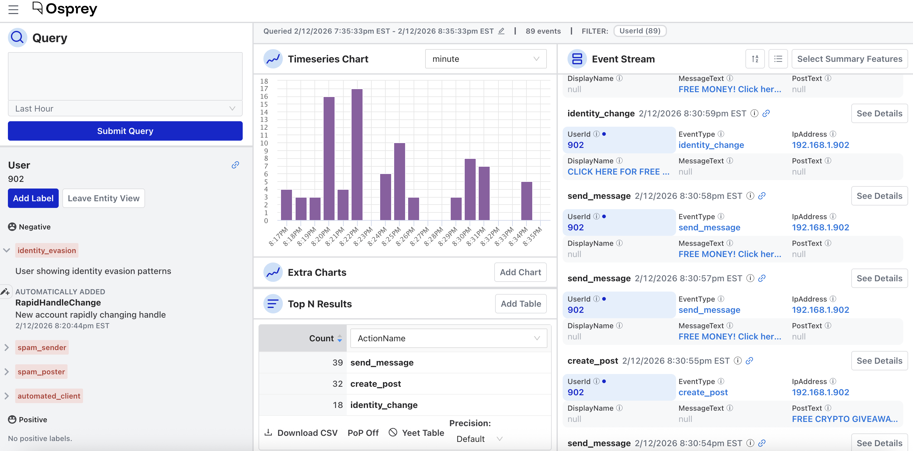
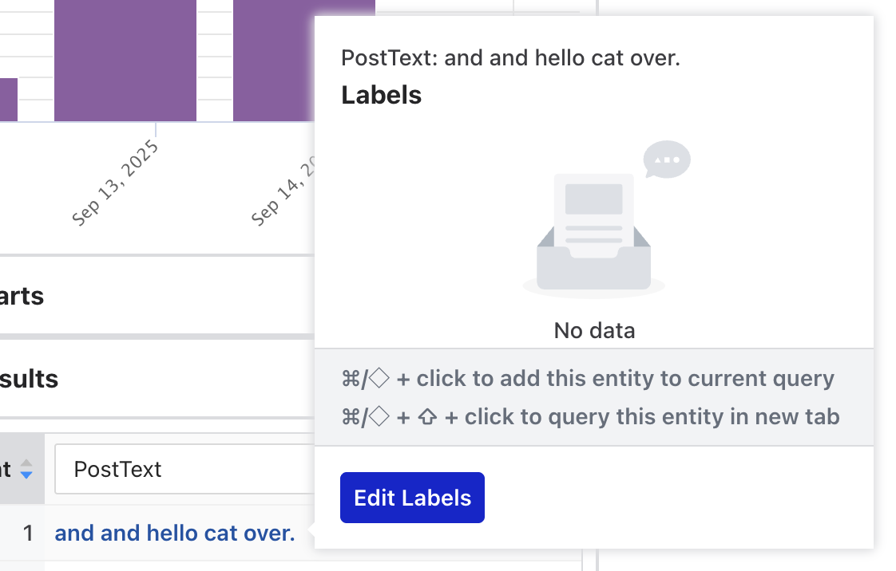
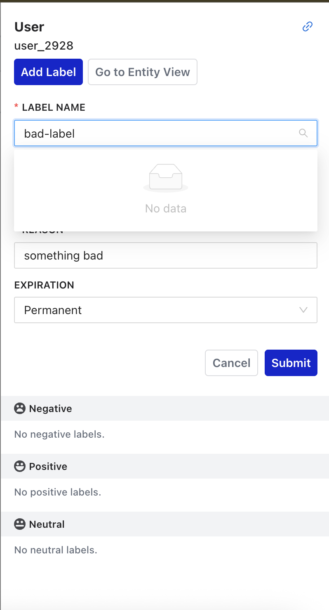
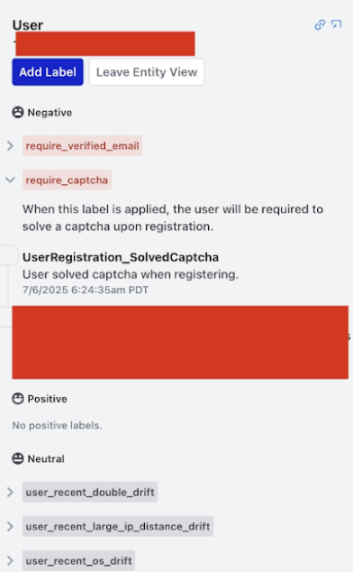

# Labels

Labels are annotations you apply to entities: users, IP addresses, emails, and other tracked objects. They're the bridge between human judgment and Osprey's automated rule system; a label you apply manually can feed into rules that act on future events automatically.

Labels have three polarities:

- **Negative**: harmful or problematic (e.g. `spammer`, `bot`, `banned`, `suspicious`)
- **Positive**: trusted or verified (e.g. `verified`, `trusted`, `premium_user`)
- **Neutral**: informational (e.g. `new_user`, `from_mobile`, `beta_tester`)

A reason is required whenever you apply a label.

## Entity Details

Selecting an entity anywhere in the UI navigates to an entity view showing every label that has ever been applied to that entity, grouped by label name.

Each label entry shows:
- The label value and type
- Whether it was applied by a rule (automated), manually, or via a bulk action
- The reason provided
- Who applied it and when

## Add manually

From a Top N table, hover over an entity row and select **Edit Labels**:

From the event stream, select any entity to open its label drawer.

For more about how labels are used, see [Writing Rules → Labels](../../rules/README.md#labels).
