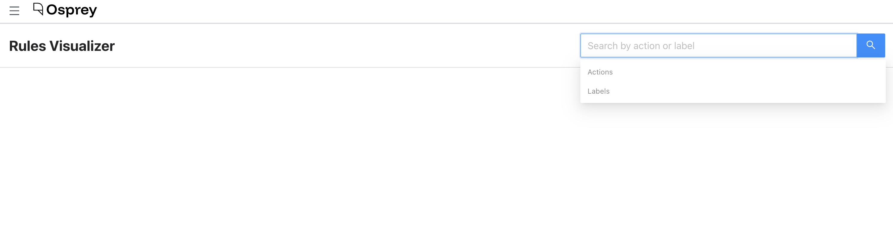
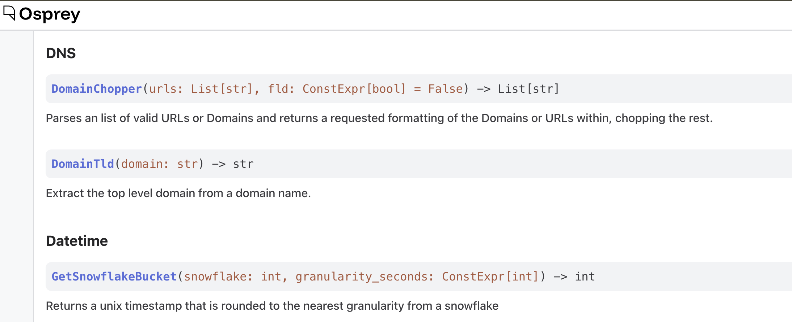

# Manage

The Manage section provides visibility into your Osprey configuration: the rules and features that power your detection, the functions available to query and rule authors, and tools to understand how everything connects.

## Rules Visualizer

The Rules Visualizer shows how labels, rules, and other labels relate to one another in a dependency graph. It's useful for understanding what will fire when a particular label is applied, or what conditions must be true for a label to be produced.

To use it, select a feature or label from the search interface. A graph appears showing the upstream and downstream relationships for your selection. You can toggle upstream and downstream visibility independently.

Node types in the graph:
- **Red ellipse**: a label that is upstream of a rule (an input condition)
- **Blue rectangle**: a rule
- **Green ellipse**: a label that is downstream of a rule (an output)

Hovering over a node shows its source file path. The graph supports zoom and pan to navigate large dependency trees.

## UDF Registry

The UDF Registry is an auto-generated API reference for every user-defined function (UDF) available in Osprey. It updates dynamically as UDFs are added or modified in code, so it always reflects what's actually available.

UDFs are organized by category and are searchable. Each entry shows:
- Function signature with syntax highlighting
- Description of what the function does
- Parameter names, types, and descriptions
- Return type

Use this page as your reference when writing queries or rules: especially to confirm a function's exact name and parameter order before using it. (Querying a UDF that doesn't exist causes a silent 500 error.)

## Features

The Features page lists every feature defined in your Osprey deployment. Features are named variables extracted from events; they're what you query against and what rules operate on.

The list is paginated (50 per page) and can be filtered and sorted:

- **Search**: filter by name, category, or description
- **Category filter**: narrow to a specific feature category
- **Extraction function filter**: narrow to features using a specific extraction function
- **Unused only**: show only features not referenced by any rule
- **Sort**: by name, most referenced, or least referenced

Each row shows the feature's name, category, extraction function(s), reference count (how many rules use it), description, owner, and last modified date.

## Rules

The Rules page lists every rule loaded in your Osprey deployment.

The list is paginated (50 per page) and can be filtered and sorted:

- **Search**: filter by name, source file, or description
- **Unused only**: hide rules that are referenced by other (when-)rules, showing only "leaf" rules
- **Sort**: by name, most referenced, or least referenced

Each row shows the rule's name, source file, description, reference count, and line number within the source file.

## Rule Authoring (Experimental feature)

Users can draft SML rules directly in the UI. Submit opens a review unit against a configured git remote so authoring, review, and merge use the same tools users already have.

The editor validates every keystroke against the same AST validator the running engine uses, so compile-time errors surface before the pull request opens. The Rule Builder view expresses the common shape (name, conditions, outcomes) as a form and generates SML; the Code Editor view accepts arbitrary SML for anything the builder can't represent.

### Rule submission backends

The Submit button routes drafts through a pluggable backend. Pick one for your deployment by setting `OSPREY_RULES_SUBMISSION_BACKEND` on the `osprey-ui-api` process:

| Value | What it does | Required env vars |
|---|---|---|
| `null` (default) | Returns 503 on any submit or list call. Ships as the default so an unconfigured install never writes anything. | none |
| `github` | Opens a pull request on a configured repo. Works with github.com and GitHub Enterprise. | `OSPREY_RULES_REPO`, `OSPREY_GITHUB_TOKEN` (+ optionals) |
| `local` | Writes SML directly to a mounted directory. For self-hosted setups whose deploy pipeline already syncs a rules directory into the engine. | `OSPREY_RULES_LOCAL_PATH` |

Env vars shared across every backend that targets a git host:

- `OSPREY_RULES_BASE_BRANCH` (default `main`) — the branch the review targets.
- `OSPREY_RULES_PATH_IN_REPO` (default empty) — subdirectory inside the target repo where rule files live, e.g. `example_rules`. Leave empty if rules sit at the repo root.

#### `github`

| Var | Default | Notes |
|---|---|---|
| `OSPREY_RULES_REPO` | _required_ | `owner/name` of the repo to PR against. |
| `OSPREY_GITHUB_TOKEN` | _required_ | Fine-grained PAT with `Contents: read/write` and `Pull requests: read/write` on the repo. |
| `OSPREY_GITHUB_API_URL` | `https://api.github.com` | Set for GitHub Enterprise: e.g. `https://github.acme.example/api/v3`. |

#### `local`

| Var | Default | Notes |
|---|---|---|
| `OSPREY_RULES_LOCAL_PATH` | _required_ | Absolute path to the directory the backend writes SML into. Must already exist. Submissions take effect immediately; there's no review queue. |

### Adding a rule submission backend

Add a Python module next to `_rule_drafts_github.py` that implements the `RuleSubmissionBackend` Protocol defined in `_rule_drafts_backend.py`, then wire it into `load_backend()`. See the module docstring on `_rule_drafts_backend.py` for the contract; the existing HTTP-backed module (`_rule_drafts_github.py`) is a working template.
