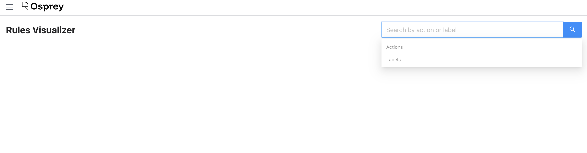
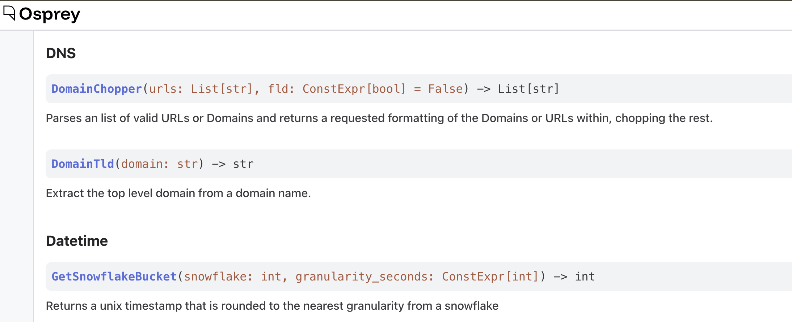

# Manage

The Manage section provides visibility into your Osprey configuration: the rules and features that power your detection, the functions available to query and rule authors, and tools to understand how everything connects.

## Rules Visualizer

The Rules Visualizer shows how rules and labels relate to one another in a dependency graph. It's useful for understanding what will fire when a particular label is applied, or what conditions must be true for a label to be produced.

To use it, search for an action or label in the search box. A graph appears showing the upstream and downstream relationships for your selection. You can toggle upstream and downstream visibility independently.

Node types in the graph:

- **Red ellipse**: a label that is upstream of a rule (an input condition)
- **Blue rectangle**: a rule
- **Green ellipse**: a label that is downstream of a rule (an output)

Hovering over a node shows its source file path. The graph supports zoom and pan to navigate large dependency trees.

## UDF Registry

The UDF Registry is an auto-generated API reference for every user-defined function (UDF) available in Osprey. It updates dynamically as UDFs are added or modified in code, so it always reflects what's actually available.

UDFs are organized by category and are searchable. Each entry shows:

- Function signature with syntax highlighting
- Description of what the function does
- Parameter names, types, and descriptions
- Return type

Use this page as your reference when writing rules, to confirm a function's exact name and parameter order. Note that most UDFs are for rules only: the query box supports just four functions (`RegexMatch`, `DidAddLabel`, `DidRemoveLabel`, `DidDeclareVerdict`), so using any other UDF in a query currently fails with a silent 500 error.

## Features Registry

The Features Registry lists every feature defined in your Osprey deployment. Features are named variables extracted from events; they're what you query against and what rules operate on.

The list is paginated (50 per page) and can be filtered and sorted:

- **Search**: filter by name, category, or description
- **Category filter**: narrow to a specific feature category
- **Extraction function filter**: narrow to features using a specific extraction function
- **Unused only**: show only features not referenced by any rule
- **Sort**: by name, most referenced, or least referenced

Each row shows the feature's name, category, extraction function(s), reference count (how many rules use it), description, owner, and last modified date.

## Rules Registry

The Rules Registry lists every rule loaded in your Osprey deployment.

The list is paginated (50 per page) and can be filtered and sorted:

- **Search**: filter by name, source file, or description
- **Unused only**: hide rules that are referenced by other (when-)rules, showing only "leaf" rules
- **Sort**: by name, most referenced, or least referenced

Each row shows the rule's name, source file, description, reference count, and line number within the source file.

## Rule Authoring (Experimental feature)

Users can draft SML rules directly in the UI. Drafts are saved to a `rules` table so the people who operate Osprey can reference, edit, and deploy them without any external code host.

The editor validates every keystroke against the same AST validator the running engine uses, so compile-time errors surface before a draft is saved. The Rule Builder view expresses the common shape (name, conditions, outcomes) as a form and generates SML; the Code Editor view accepts arbitrary SML for anything the builder can't represent.

### Permissions

Rules use three abilities, each strictly more privileged than the last. All are granted to `super_user`.

| Ability            | Grants                                                    |
| ------------------ | --------------------------------------------------------- |
| `CAN_VIEW_RULES`   | Reading of existing rules in the engine and their sources |
| `CAN_EDIT_RULES`   | Drafting: validate, parse, create, list and fetch drafts  |
| `CAN_DEPLOY_RULES` | Publishing into the rules directory                       |

Editing and deploying are separate because their blast radius differs: a draft is reversible and visible only in the UI, a deploy is neither.

> [!WARNING]
> **`GET /rules` previously required `CAN_VIEW_DOCS`.** It now requires `CAN_VIEW_RULES`, so ACLs granting only `CAN_VIEW_DOCS` lose access to the Rules Registry page until they are updated.

### Endpoints

Drafts live in a Postgres table (`rules`), one row per rule file path:

- `POST /rules/drafts` — re-validates the SML server-side, then upserts the draft.
- `GET /rules/drafts` — lists every draft, most recently edited first.
- `GET /rules/drafts/<id>` — fetches a single draft.
- `POST /rules/drafts/<id>/deploy` — re-validates, writes the SML into the rules directory, and marks the draft `deployed`. Pass `wire_into_main: true` to also add a `Require(rule=...)` line to `main.sml`, described below.

Three more endpoints back the editor rather than the table:

- `POST /rules/drafts/validate` splices a draft into the engine's sources and returns any errors without saving anything — this is what the editor calls as you type.
- `POST /rules/drafts/parse` renders existing SML as a Rule Builder model, or reports that the file uses something the builder can't express, which is how the UI decides whether to offer the Builder toggle.
- `GET /rules/vocabulary` returns the features, UDFs and effects the Builder's dropdowns offer.

Reading is served by `GET /rules` for the catalog and `GET /rules/source` for a single rule's SML as it exists on disk. A draft's own SML comes from the table via `GET /rules/drafts/<id>`, not from `/rules/source`.

`main.sml` can be validated against but never saved as a draft: it is the engine's entry point, and rules are wired into it a line at a time rather than replaced wholesale.

### Deploying

Deploying writes the draft's SML into the directory the engine loads from, set by `OSPREY_RULES_PATH`, and the engine picks it up on its next load. That directory must already exist. With the variable unset, drafting and validation still work and deploying returns 503.

Deploy writes to the same directory the engine reads rather than a separate one, because a file written anywhere else is never loaded, deploy would otherwise report success for a rule that never takes effect.

Because a rule file is inert until something requires it, deploying can also append a `Require(rule=...)` line to `main.sml`. It parses `main.sml` to check whether the rule is already required, and refuses the deploy if that file is missing or doesn't compile: appending to a file the engine can't parse would break it a second way and bury the original error under a new one. Nothing is written in either case, so a refused deploy never leaves the rule file on disk unwired.

> [!WARNING]
> **Deploy does not work with the etcd sources provider.** The engine reads from a directory when `OSPREY_RULES_PATH` is set and from etcd when it is not; only the first is supported. Under etcd, nothing publishes a written file until `osprey push-rules <dir>` is run against the directory, so deploy would report success for a rule that never goes live. Publish rules with `osprey push-rules` on those deployments.

A future DB-backed `SourcesProvider` could let the engine load deployed rules straight from the `rules` table, removing the filesystem hand-off and the etcd limitation with it, so rule management would need no external infrastructure at all. The table is already the source of truth for drafts.
