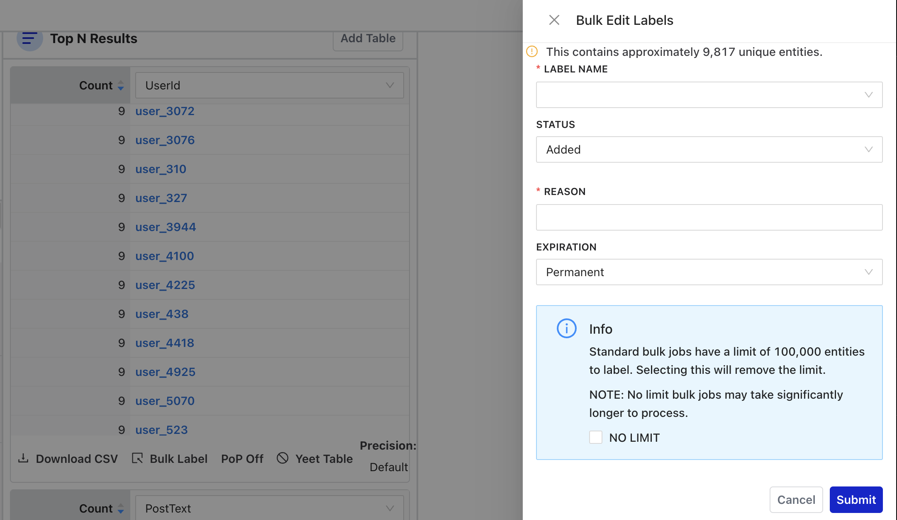
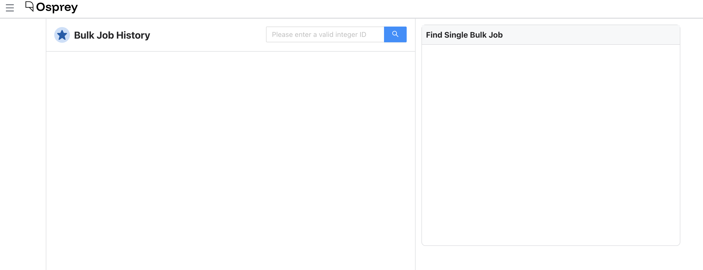

# Operate

The Operate section contains tools for running bulk labeling jobs and reviewing their results. These operations can affect a large number of entities at once, so Osprey includes safeguards to help prevent unintended impact.

## Bulk Actions

Bulk Actions let you apply a label to every entity matching the current query; useful when you've identified a clear pattern and want to act on many entities at once.

> [!WARNING]
> A false positive in a bulk action can label a large number of entities incorrectly. **Always review the entity count before confirming a job.**

### Starting a bulk action

There are two ways to start a bulk action:

1. **Bulk Actions** → **Create New Job** to open the job creation modal
2. **From the Query page**: use the bulk label drawer in the chart column, which pre-fills the query from your current session

Before submitting, Osprey shows a count of how many unique entities will be labeled. Review this number carefully to understand the impact of your bulk action.

> For scripted or bulk labeling from the command line (e.g., importing label lists from external sources), see `apply_label` and `bulk_apply_label` in the [CLI Reference](../development/cli-reference.md#apply_label).

Each job requires:
- The entity type and label to apply
- A reason (required for all labeling operations)
- The label polarity (negative, positive, or neutral)

### Monitoring jobs

The Bulk Actions page shows a table of all jobs with their ID, status, progress percentage, the user who created them, and when they were created. Jobs that are still running show a cancel button.

The page polls for updates automatically; you don't need to refresh to see progress.

## Bulk Job History

The Bulk Job History page provides a detailed view of past bulk jobs.

The page has two columns:
- Recent bulk jobs with status, progress, and summary statistics; filterable by task ID
- Detailed view of a single job, including its full results and logs

To look up a specific job, enter its task ID in the search field. Each bulk job has a unique ID that's logged when the job is created.
