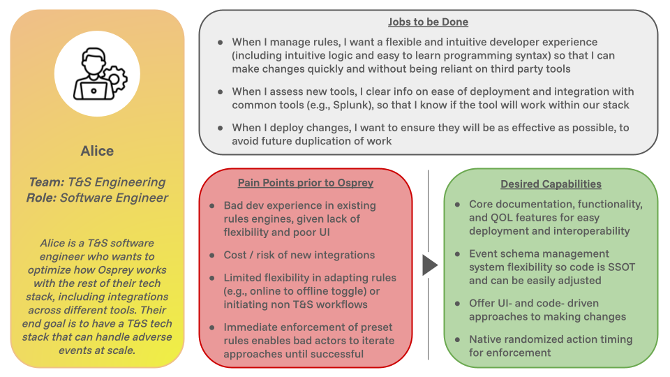
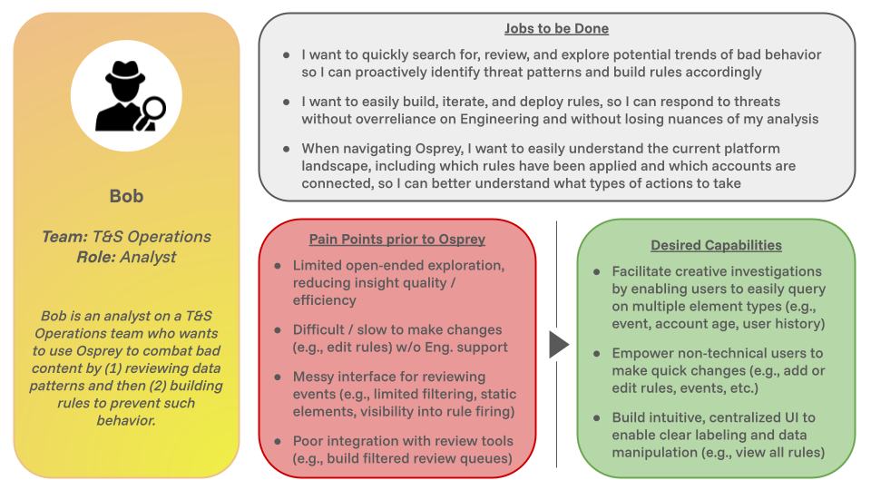

# User Research Overview

Osprey is designed for users who need to investigate and take automated action on events in real-time. By interviewing prospective Osprey users, ROOST has drafted the following user personas for developers to better understand who might be interested in using this tool. We hope this research helps the open source community prioritize features to build moving forward!

## T&S Engineers

Most engineers who are interested in potentially using Osprey are like Alice – they do not currently have a viable rules engine due to cost, lack of flexibility, or limited available options. However, they need a tool for real-time event processing to handle adverse events at scale. They also want to optimize how Osprey works with the rest of their tech stack.

*Jobs to be done include:*

- When I manage rules, I want a flexible and intuitive developer experience (including intuitive logic and easy to learn programming syntax) so that I can make changes quickly and without being reliant on third party tools

- When I assess new tools, I clear info on ease of deployment and integration with common tools (e.g., Splunk), so that I know if the tool will work within our stack

- When I deploy changes, I want to ensure they will be as effective as possible, to avoid future duplication of work

*Pain points prior to Osprey include:*

- Bad dev experience in existing rules engines, given lack of flexibility and poor UI

- Cost / risk of new integrations

- Limited flexibility in adapting rules (e.g., online to offline toggle) or initiating non T&S workflows

- Immediate enforcement of preset rules enables bad actors to iterate approaches until successful 

*Desired capabilities from Osprey include:*

- Core documentation, functionality, and QOL features for easy deployment and interoperability

- Event schema management system flexibility so code is SSOT and can be easily adjusted

- Offer UI- and code- driven approaches to making changes

- Native randomized action timing for enforcement

## T&S Operations Teams

T&S analysts like Bob are primarily concerned with their ability to (1) intuitively analyze data trends of adverse behavior and (2) quickly iterate on rules to take enforcement actions against such behavior.

*Jobs to be done include:*

- I want to quickly search for, review, and explore potential trends of bad behavior so I can proactively identify threat patterns and build rules accordingly

- I want to easily build, iterate, and deploy rules, so I can respond to threats without overreliance on Engineering and without losing nuances of my analysis

- When navigating Osprey, I want to easily understand the current platform landscape, including which rules have been applied and which accounts are connected, so I can better understand what types of actions to take

*Pain points prior to Osprey include:*

- Limited open-ended exploration, reducing insight quality / efficiency

- Difficult / slow to make changes (e.g., edit rules) w/o Eng. support

- Messy interface for reviewing events (e.g., limited filtering, static elements, visibility into rule firing)

- Poor integration with review tools (e.g., build filtered review queues)

*Desired capabilities from Osprey include:*

- Facilitate creative investigations by enabling users to easily query on multiple element types (e.g., event, account age, user history) 

- Empower non-technical users to make quick changes (e.g., add or edit rules, events, etc.)

- Build intuitive, centralized UI to enable clear labeling and data manipulation (e.g., view all rules)
